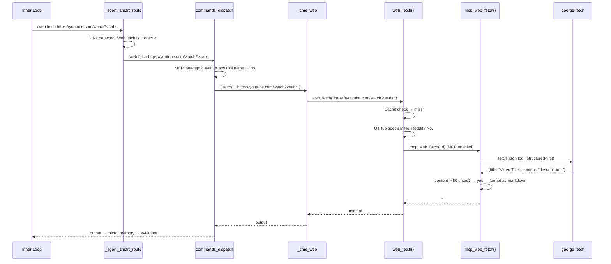

# Agent Loop & Task Execution

> How George decomposes tasks, routes commands, escalates failures, and evaluates completion — the two-loop execution engine that drives autonomous work.

---

## Table of Contents

- [Design Philosophy](#design-philosophy)
- [Architecture Overview](#architecture-overview)
- [The Honeydew List System](#the-honeydew-list-system)
- [The Macro Loop (Task Level)](#the-macro-loop)
- [The Inner Loop (Milestone Level)](#the-inner-loop)
- [Smart Command Routing](#smart-command-routing)
- [MCP Service Boundary in Execution](#mcp-service-boundary-in-execution)
- [The Router-Specialist Pipeline](#the-router-specialist-pipeline)
- [Five-Level Failure Escalation](#five-level-failure-escalation)
- [The Dual Evaluator System](#the-dual-evaluator-system)
- [Honeydew Rewriting](#honeydew-rewriting)
- [Micro and Macro Memory](#micro-and-macro-memory)
- [Web Research Interlock](#web-research-interlock)
- [Plan Validation](#plan-validation)
- [Troubleshooting](#troubleshooting)
- [Key Functions Reference](#key-functions-reference)

---

## Design Philosophy

The agent is built around a **deterministic outer loop with LLM inner intelligence** model. Rather than letting the LLM freely decide what to do next, the agent constrains it:

1. **Structured decomposition** — Tasks are broken into a numbered checklist (honeydew list) before any execution begins
2. **Narrow routing** — Each step goes through a deterministic eligibility pass, then a router bounded to a 3-5 command shortlist
3. **Bounded execution** — Each milestone has a fixed number of retry rounds before escalation
4. **Dual evaluation** — Both milestone-level and task-level evaluators gate progress
5. **File-based memory** — All state persists in JSON files, surviving subshells and crashes

This architecture prevents the two most common agentic failure modes:
- **Runaway loops** — The step counter and escalation levels provide hard ceilings
- **Context drift** — The honeydew list keeps the agent focused on the original task

---

## Architecture Overview

```
User Request: "Build a REST API server in Rust"
     │
     ▼
┌─ Honeydew Build ─────────────────────────────────────────────┐
│  LLM decomposes into numbered checklist:                      │
│  1. [ ] Create new Rust sandbox                               │
│  2. [ ] Add dependencies to Cargo.toml                        │
│  3. [ ] Write main server code                                │
│  4. [ ] Add route handlers                                    │
│  5. [ ] Run tests                                             │
│  6. [ ] Build and verify                                      │
└──────────────────────────────────────────────────────────────┘
     │
     ▼
┌─ Macro Loop ─────────────────────────────────────────────────┐
│  For each honeydew item:                                      │
│  ┌─ Inner Loop ──────────────────────────────────────────┐   │
│  │  1. Eligibility pass → legal commands + shortlist     │   │
│  │  2. Router → picks one shortlisted command            │   │
│  │  3. Specialist → generates exact command syntax       │   │
│  │  4. Execute → run command, capture output             │   │
│  │  5. Evaluate milestone → COMPLETE or INCOMPLETE       │   │
│  │  6. If INCOMPLETE → escalate (retry/recall/web)       │   │
│  └───────────────────────────────────────────────────────┘   │
│  Mark honeydew item done ✓                                    │
│  Evaluate overall → more items? continue                      │
│  All done? → TASK COMPLETE                                    │
└──────────────────────────────────────────────────────────────┘
```

---

## The Honeydew List System

### What Is It?

A honeydew list is a flat, numbered checklist that the LLM generates from the user's task. It's stored as JSON:

```json
{
  "primary_task": "Build a REST API server in Rust",
  "items": [
    {"id": 1, "task": "Create new Rust sandbox named myapi", "status": "done", "depth": 0},
    {"id": 2, "task": "Add actix-web and serde to Cargo.toml", "status": "pending", "depth": 0},
    {"id": 3, "task": "Write main.rs with server startup", "status": "pending", "depth": 0},
    {"id": 4, "task": "Add GET and POST route handlers", "status": "pending", "depth": 0},
    {"id": 5, "task": "Run cargo test", "status": "pending", "depth": 0},
    {"id": 6, "task": "Build release binary", "status": "pending", "depth": 0}
  ]
}
```

### Building the Honeydew (`_agent_honeydew_build`)

The LLM receives a **decomposition prompt** with constraints:

```
Decompose this task into 3-6 concrete steps.
Each step must be achievable with ONE slash command.
Do NOT include testing unless explicitly requested.
Output format: numbered list (1. 2. 3.)
```

The function then parses the LLM output:

```bash
_agent_honeydew_build() {
    local task="$1"
    local raw_plan

    raw_plan=$(llm_generate "$decompose_prompt" "$task")

    # Parse numbered list into JSON
    local items="[]"
    local id=1
    while IFS= read -r line; do
        if [[ "$line" =~ ^[0-9]+[\.\)][[:space:]]*(.*) ]]; then
            local item_text="${BASH_REMATCH[1]}"
            items=$(echo "$items" | jq \
                --arg id "$id" \
                --arg task "$item_text" \
                '. + [{"id":($id|tonumber),"task":$task,"status":"pending","depth":0}]')
            ((id++))
        fi
    done <<< "$raw_plan"

    # Write honeydew.json
    jq -n --arg task "$task" --argjson items "$items" \
        '{"primary_task":$task,"items":$items}' > "$HONEYDEW_FILE"
}
```

**Bash Technique — `BASH_REMATCH`**: The `=~` regex operator stores capture groups in the `BASH_REMATCH` array. `BASH_REMATCH[0]` is the full match, `BASH_REMATCH[1]` is the first group. This extracts the item text after the number prefix.

### Inline List Detection

Sometimes the LLM returns items on one line: `1. Create sandbox 2. Add deps 3. Write code`

The parser detects this and splits:

```bash
# Insert newlines before "N. " patterns that aren't at line start
sed 's/\([^0-9]\)\([0-9]\{1,2\}\.[[:space:]]\{1,2\}\)/\1\n\2/g'
```

### Automatic Item Checking (`_agent_honeydew_auto_check`)

After a milestone completes, the system matches it to a honeydew item:

```bash
_agent_honeydew_auto_check() {
    local milestone_summary="$1"

    # Tokenize the summary into keywords
    local -a summary_words
    IFS=' ' read -ra summary_words <<< "$(echo "$milestone_summary" | tr '[:upper:]' '[:lower:]')"

    # Score each pending item by keyword overlap
    local best_id=0 best_score=0
    while read -r item; do
        local id=$(echo "$item" | jq -r '.id')
        local task=$(echo "$item" | jq -r '.task' | tr '[:upper:]' '[:lower:]')
        local score=0
        for word in "${summary_words[@]}"; do
            [[ "$task" == *"$word"* ]] && ((score++))
        done
        if (( score > best_score )); then
            best_score=$score
            best_id=$id
        fi
    done < <(jq -c '.items[] | select(.status=="pending")' "$HONEYDEW_FILE")

    # Mark best match as done (if score > threshold)
    (( best_score >= 2 )) && _agent_honeydew_mark "$best_id"
}
```

**Complexity**: O(n×m) where n = pending items, m = summary words. Acceptable because n ≤ 10 and m ≤ 50 in practice.

---

## The Macro Loop

The macro loop iterates over honeydew items:

```bash
agent_run() {
    local task="$1"

    # Build honeydew list
    _agent_honeydew_build "$task"
    _macro_init "$task"

    local step=0
    while (( step < AGENT_MAX_STEPS )); do
        # Get next pending item
        local next_item
        next_item=$(jq -r '.items[] | select(.status=="pending") | .task' "$HONEYDEW_FILE" | head -1)
        [[ -z "$next_item" ]] && break  # All items done!

        # Execute inner loop for this milestone
        agent_inner_loop "$next_item"
        local result=$?

        # Record completed milestone
        _macro_add_milestone "$next_item" "$_MILESTONE_SUMMARY"

        # Auto-check honeydew item
        _agent_honeydew_auto_check "$_MILESTONE_SUMMARY"

        # Maybe rewrite remaining honeydew items
        _agent_honeydew_maybe_rewrite

        ((step++))
    done

    # Final evaluation
    _agent_evaluate_completion
}
```

### Step Ceiling

`AGENT_MAX_STEPS=40` is the absolute ceiling. Even if items remain, the agent stops after 40 milestones. This prevents infinite loops from honeydew rewriting continuously adding new items.

---

## The Inner Loop

Each honeydew item becomes a **micro-objective** that the inner loop executes:

```bash
agent_inner_loop() {
    local objective="$1"

    # Clean slate for this milestone
    _micro_init
    _micro_set "micro_objective" "$objective"

    # Inject context from macro level
    _micro_set "honeydew_progress" "$(_agent_honeydew_status)"
    _micro_set "prior_milestones" "$(_macro_milestones_json 3)"

    local level=0
    while (( level < AGENT_INNER_LOOPS )); do
        # Phase 0: Eligibility pass (legal commands + shortlist)
        eligibility=$(_agent_router_eligibility_pass "$objective" "$PWD" "$svc_status")

        # Phase 1: Pre-route / fast-route / shortlist router
        selected_tool=$(_agent_route_with_shortlist "$objective" "$eligibility")

        # Phase 2: Specialist (generate exact syntax for selected tool)
        cmd=$(_agent_specialize "$selected_tool" "$objective")

        # Phase 3: Smart Route (fix syntax-level routing errors)
        cmd=$(_agent_smart_route "$cmd")

        # Phase 4: Execute (MCP dispatch intercept → normal routing → MCP-first lib calls)
        local output exit_code
        output=$(commands_dispatch "$cmd" 2>&1 | head -c 2000)
        exit_code=${PIPESTATUS[0]}

        # Record action
        _micro_add_action "$cmd" "$exit_code" "$output"

        # Phase 5: Evaluate
        if _agent_evaluate_milestone; then
            return 0   # Milestone complete
        fi

        # Phase 6: Escalate
        _agent_escalate "$level" "$cmd" "$output"
        ((level++))
    done

    return 1   # Failed after all escalation levels
}
```

### Pre-Route Extraction (Phase 0)

Before calling the LLM, check if the milestone text already contains an explicit command:

```
Milestone: "/sandbox new myapi rust"
→ Pre-route extracts: /sandbox new myapi rust (skip router, keep specialist syntax generation)

Milestone: "Create a new Rust project"
→ No command found, proceed to router
```

This saves the router LLM call when the honeydew item is already precise.

> **Note:** Pre-route is controlled by `AGENT_PRE_ROUTE` (default: 1) and is
> independent of `AGENT_SMART_ROUTE`. Disabling smart-route does not
> disable pre-route.

---

## Routing Configuration

### `AGENT_ROUTING` (consolidated preset)

Sets `AGENT_PRE_ROUTE`, `AGENT_FAST_ROUTE`, and `AGENT_SMART_ROUTE` as
a single value. When set, individual settings are overridden:

| Preset | Label | PRE_ROUTE | FAST_ROUTE | SMART_ROUTE |
|--------|-------|-----------|------------|-------------|
| 0 | minimal | 0 | 0 | 0 |
| 1 | standard | 1 | 1 | 1 |
| 2 | full-llm | 1 | 0 | 1 |
| 3 | enhanced | 1 | 1 | 3 |

When `AGENT_ROUTING` is unset (empty string), the individual variables
are used as-is. Use `/limits routing <0-3>` to set the preset.

### Specialist Tool Mismatch Recovery

When the router picks one command but the specialist outputs a different
one, the mismatch check intervenes:

1. **Milestone-authoritative override:** If the milestone text itself
   contains the specialist's command (e.g. milestone says "Use /journal
   write..." and specialist outputs `/journal write ...`), the specialist
   is trusted over the router.

2. **Retry cap (2):** After 2 consecutive mismatches without an override,
   the specialist is trusted to break the deadlock.

3. **Feedback injection:** On rejection, mismatch context is injected into
   `_last_eval_feedback` so the router can self-correct on the next attempt.

---

## Smart Command Routing

### Deterministic Eligibility Pass

Before pre-route, fast-route, or the router LLM can pick a tool, the inner loop calls `_agent_router_eligibility_pass()`.
This pass is deterministic and cheap: it inspects the micro-objective text, checks command locks, probes network reachability, and consumes `commands_services_status()`.

What it produces for each milestone:

- An `eligible` set of legal commands for the current task stage
- A `shortlist` capped by `AGENT_ROUTER_SHORTLIST_MIN` and `AGENT_ROUTER_SHORTLIST_MAX` (default 3-5 commands)
- `negative_guidance` that explicitly blocks common misroutes such as `/web` for local files or `/recall` for live internet facts
- An `offline_fallback` flag with an `offline_reason` when web research is requested but network/provider state makes `/web` ineligible

The pass also persists compact trace events to `.george/routing_trace.jsonl` so classifier → eligibility → shortlist → routed-command flows can be audited after a run.

Typical offline fallback shortlist:

```json
{
    "web_allowed": false,
    "offline_fallback": true,
    "offline_reason": "web-search provider not configured",
    "shortlist": ["recall", "ls", "journal", "respond"]
}
```

### `_agent_smart_route()`

A heuristic fixer that catches common LLM routing errors **without** another LLM call:

| LLM Generated | Problem | Smart Route Correction |
|---------------|---------|----------------------|
| `/read https://example.com` | URL with local read | `/web fetch https://example.com` |
| `/web fetch ./local-file.txt` | Local file with web fetch | `/read ./local-file.txt` |
| `/read image.png` | Image with text reader | `/vision image.png` |
| `/web search "install rust"` | URL that looks like search | Kept as-is |

The cascading priority:

```
1. Does the target exist as a local file? → /read or /vision
2. Does the target have a TLD (.com, .org)? → /web fetch
3. Does the target look like a search query? → /web search
```

The `_SMART_ROUTE_REROUTED` flag lets the evaluator know a correction was made, so it can retry the original if the correction fails.
This happens after the deterministic eligibility pass, so smart-route fixes do not widen the set of commands the router was allowed to choose from.

---

## MCP Service Boundary in Execution

### How Commands Reach MCP

When the inner loop calls `commands_dispatch()` in Phase 4, the command
flows through multiple layers before hitting the outside world. MCP acts
as the **service boundary** — the single point where all external
interactions are mediated:

```
┌─ Inner Loop Phase 4: Execute ────────────────────────────────┐
│                                                               │
│  commands_dispatch("/web fetch https://youtube.com/...")       │
│       │                                                       │
│       ├─ 1. MCP dispatch intercept                            │
│       │     _mcp_dispatch_intercept() checks if a running     │
│       │     MCP server has a tool matching the command         │
│       │     (/git status → git_status tool). If matched,      │
│       │     call tool directly and return.                     │
│       │                                                       │
│       └─ 2. Normal command dispatch (if no MCP intercept)     │
│             Route to _cmd_web(), _cmd_git(), etc.             │
│                  │                                             │
│                  ▼                                             │
│             Lib function (web_fetch, mqtt_publish, x_post)    │
│                  │                                             │
│                  ├─ Domain cleaning (strip quotes, normalize)  │
│                  ├─ Local fast-path (cache, special APIs)      │
│                  └─ MCP-first call                             │
│                       │                                        │
│                       ▼                                        │
│                  MCP wrapper (mcp_web_fetch, mcp_x_post)      │
│                       │                                        │
│                       ▼                                        │
│                  MCP server (george-fetch, george-x)           │
│                       │                                        │
│                       ▼                                        │
│                  Raw execution (curl, git, mosquitto_pub)      │
│                                                               │
└──────────────────────────────────────────────────────────────┘
```

### Two MCP Entry Points

There are two distinct paths into MCP:

**Path A — Dispatch Intercept** (used by git commands):
The command name itself maps to an MCP tool. `/git status` becomes
`git_status`, and `_mcp_dispatch_intercept()` calls the george-git
server directly. The lib function is bypassed entirely.

**Path B — Lib-Level Routing** (used by web, MQTT, X):
The command routes through normal dispatch to a lib function like
`web_fetch()`. The lib function does domain-specific work (caching,
URL normalization) then calls its MCP wrapper as the primary execution
path.

### Concrete Example: `/web fetch https://youtube.com/watch?v=abc`



### Why Two Paths?

**Git** uses dispatch intercept because the MCP server calls `git`
directly — there's no lib-level cleaning needed. `/git status` goes
straight to the george-git server.

**Web, MQTT, X** use lib-level routing because the lib functions add
value before MCP: URL normalization, cache checking, Reddit/GitHub
special-casing, argument pre-parsing. The MCP server is the execution
backend, not the entry point.

---

## The Router-Specialist Pipeline

### Phase 1: Router

The routing phase is now staged. George does not hand the router a broad command catalog and hope for the best.
Instead, the inner loop narrows the decision space before any LLM routing call runs.

```bash
_eligibility_json=$(_agent_router_eligibility_pass "$micro_objective" "$workdir" "$svc_status")

# 1. Pre-route: honor explicit /cmd in the milestone text when eligible
# 2. Fast-route: use keyword routing only if the result is in the shortlist
# 3. LLM router: choose exactly one command from the shortlist or /respond

route_prompt="ROUTER SHORTLIST (choose ONLY one):\n${_shortlist_block}"
route_prompt+="\nABSTAIN RULE: if confidence is low, use /respond."
route_prompt+="\nNEGATIVE GUIDANCE:\n${_negative_guidance}"

selected_tool=$(llm_generate "$route_prompt" "$router_sys")
```

The hard bounds around this phase are what changed materially:

- Pre-route is rejected if the extracted command is not in the `eligible` set
- Fast-route is rejected if the keyword match is not in the `shortlist`
- The LLM router is instructed to choose from the shortlist only and to abstain with `/respond` when uncertain
- If the router still emits a tool outside the shortlist, George deterministically falls back to the first shortlist entry and records `router_shortlist_fallback` in `.george/routing_trace.jsonl`
- If offline fallback is active, internet-dependent commands such as `/web`, `/git`, `/social`, `/email`, and `/download` are remapped to `/recall`

The router prompt is now a shortlist prompt, not a full-catalog prompt:

```
Route the next action using the deterministic shortlist below.

ROUTER SHORTLIST (choose ONLY one):
/read
/grep
/respond

ABSTAIN RULE: if confidence is low, use /respond.

NEGATIVE GUIDANCE:
- NEVER use /web for local file reading, local repo inspection, or memory retrieval.
- NEVER use /recall for live internet facts.

Objective: inspect the file contents and report the answer
Output: /read
```

### Phase 2: Specialist

The specialist takes the router's command choice and generates the exact syntax:

```bash
_agent_specialize() {
    local command="$1" objective="$2"

    local prompt
    prompt=$(_build_specialist_prompt "$command" "$objective")

    LLM_SCENARIO=specialist  # temp=0.3
    local detailed
    detailed=$(llm_generate "$prompt" "$objective")

    # Post-processing: strip shell quotes, trim search queries, etc.
    detailed=$(_agent_normalize_specialist "$detailed")

    echo "$detailed"
}
```

The specialist prompt includes a **syntax card** for the selected command:

```json
{
  "command": "/sandbox",
  "syntax": "/sandbox new <name> <type>",
  "types": "rust|python|shell",
  "examples": ["/sandbox new myapi rust", "/sandbox new utils python"],
  "rules": ["Name must be lowercase alphanumeric", "Type determines build tool"]
}
```

The specialist no longer gets to re-broaden the router's decision during the normal path. Once routing has selected `/read`, `/grep`, `/web`, or another command, the specialist gets that command's syntax card and generates concrete arguments. The only time George reopens command choice inside the specialist path is hallucination recovery, where the router produced an invalid command and the system falls back to a compact re-route catalog.

### Task-First Injection (Primacy Bias)

For small (4B) models, the task description is placed at the very beginning of the specialist prompt to exploit **primacy bias** — these models pay strongest attention to the first tokens:

```bash
# Instead of:
# <system context> ... <command syntax> ... <objective>

# We do:
# <objective> ... <system context> ... <command syntax>
```

---

## Five-Level Failure Escalation

When a milestone evaluation returns INCOMPLETE, the inner loop escalates:

```
Level 0: Execute (standard router → specialist → run)
     │
     ▼ FAILED
Level 1: Naive Retry
     │   Sleep 1 second, re-execute same pipeline
     │   (Catches transient network errors, race conditions)
     │
     ▼ FAILED
Level 2: Knowledge Recall
     │   Force /recall on the base command topic
     │   Inject recall results into specialist context
     │   (Catches: unknown syntax, forgotten config steps)
     │
     ▼ FAILED
Level 3: Syntax Permutation
     │   Re-run specialist with error output injected
     │   Identicality lockout: reject if same command generated
     │   (Catches: argument order, missing flags)
     │
     ▼ FAILED
Level 4: Same as L3 with stronger error emphasis
     │
     ▼ FAILED
Level 5: Web Search Fallback
     │   Force /web search "<error message> <command>"
     │   Inject search results into specialist
     │   (Catches: external issues, API changes, version problems)
     │
     ▼ FAILED
Terminal: Human Operator
     │   read from /dev/tty
     │   (Last resort: ask the operator for guidance)
```

### Identicality Lockout (L3-L4)

If the specialist generates the exact same command after seeing the error, the inner loop rejects it:

```bash
if [[ "$new_cmd" == "$failed_cmd" ]]; then
    ui_warn "Specialist regenerated identical command. Skipping."
    ((level++))
    continue
fi
```

This prevents the agent from executing the same failing command repeatedly.

---

## The Dual Evaluator System

### Pass 1: Milestone Evaluator

Judges whether the current milestone's actions achieved the micro-objective:

```bash
_agent_evaluate_milestone() {
    # Build evaluation context from micro_memory
    local context
    context=$(_micro_serialize_eval)

    local prompt="Given these actions and results, did the milestone succeed?
Milestone: $objective
$context
Answer: COMPLETE or INCOMPLETE (one word)"

    LLM_SCENARIO=router  # Fast, deterministic
    local verdict
    verdict=$(llm_generate "$prompt")

    # Contradiction detection
    if [[ "$verdict" == *"COMPLETE"* ]] && [[ "$verdict" == *"not"*"achieved"* ]]; then
        ui_warn "Evaluator contradiction detected. Forcing INCOMPLETE."
        verdict="INCOMPLETE"
    fi

    [[ "$verdict" == *"COMPLETE"* ]] && return 0
    return 1
}
```

**Contradiction Detection**: Small models sometimes produce `COMPLETE: the milestone was not achieved because...` The evaluator catches this by checking for negation words near the COMPLETE verdict.

### Pass 2: Overall Evaluator

Judges whether the entire task (primary objective) is done:

```bash
_agent_evaluate_completion() {
    # HARD GATE: if honeydew exists, use deterministic check
    if [[ -f "$HONEYDEW_FILE" ]]; then
        local pending
        pending=$(jq '[.items[] | select(.status=="pending")] | length' "$HONEYDEW_FILE")
        if (( pending == 0 )); then
            return 0   # All items done → COMPLETE (no LLM needed)
        fi
        return 1   # Items remain → not complete
    fi

    # LLM PATH: for tasks without honeydew
    local context
    context=$(_macro_serialize_lean)
    # ... LLM evaluation ...
}
```

**Key insight**: When a honeydew list exists, completion is **deterministic** — all items done = complete. This avoids the LLM prematurely declaring completion.

### Honeydew Item Evaluator

A third evaluation specifically for matching milestones to honeydew items:

```bash
_agent_evaluate_honeydew_item() {
    # Did the completed milestone satisfy the current honeydew item?
    # Uses raw action outputs (not milestone summary) for accuracy
    # Sets _EVAL_HONEYDEW_ITEM_NUM, _EVAL_HONEYDEW_REASON
}
```

---

## Honeydew Rewriting

### Why Rewrite?

As the agent works through a task, the remaining honeydew items may become stale:

- A step turns out to be unnecessary (already done by a previous step)
- New requirements emerge from execution outputs
- The approach needs to change due to discovered constraints

### Two-Phase Rewrite

```bash
_agent_honeydew_rewrite() {
    # Phase 1: ROUTER decides whether to rewrite
    local decision
    decision=$(llm_generate "$router_prompt")
    # Decision: "REWRITE" or "KEEP"

    [[ "$decision" != *"REWRITE"* ]] && return 0

    # Phase 2: REWRITER regenerates pending items
    local new_items
    new_items=$(llm_generate "$rewriter_prompt")
    # Parse new numbered list into JSON, replace pending items
    # Keep completed items unchanged
}
```

**Guards**:
- `AGENT_HONEYDEW_REWRITE=1` must be enabled
- Maximum `AGENT_HONEYDEW_REWRITE_ROUNDS=3` rewrites per task
- `AGENT_HONEYDEW_REWRITE_CADENCE=2` — minimum new milestones between rewrites (prevents constant re-evaluation; forced rewrites from interlock/pressure-relief bypass this gate)
- Clears stale research buffer and micro_memory on rewrite

### Honeydew Expansion

Complex honeydew items can be expanded into sub-items:

```
Before: 3. Build and test the API with error handling
After:  3. Add error handling middleware
        4. Write unit tests for handlers
        5. Run cargo test and fix failures
```

```bash
_agent_honeydew_expand() {
    local item_id="$1"

    # Check depth ceiling
    local depth=$(jq ".items[] | select(.id==$item_id) | .depth" "$HONEYDEW_FILE")
    (( depth >= AGENT_MAX_DEPTH )) && return 1

    # Redundancy guard: check overlap with existing items
    # If siblings overlap ≥60% of keywords → don't expand
    ...

    # LLM splits into 2-4 sub-items
    local expanded
    expanded=$(llm_generate "$expand_prompt")

    # Insert in-place, renumber all IDs
    ...
}
```

---

## Micro and Macro Memory

### Micro Memory (Per-Milestone)

A JSON file (`.george/micro_memory.json`) that tracks the current milestone:

```json
{
    "micro_objective": "Add actix-web dependency",
    "action_log": [
        {
            "action": "/sandbox build myapi",
            "status": "success",
            "exit_code": 0,
            "output": "Compiling actix-web v4.0...",
            "source": "specialist"
        }
    ],
    "honeydew_progress": "2/6 complete | Next: 3. Write main.rs",
    "prior_milestones": ["Created sandbox myapi", "Added Cargo.toml deps"],
    "research_context": "",
    "sufficiency_reached": false,
    "warnings": [],
    "milestone_result": null
}
```

**Reset at each milestone**: `_micro_init()` wipes the file at the start of each inner loop iteration. This prevents context bleed between milestones.

### Macro Memory (Per-Task)

A JSON file (`.george/macro_memory.json`) that tracks the entire task:

```json
{
    "task_started": "2026-03-08T14:30:00Z",
    "persona": "George is a coding assistant...",
    "primary_objective": "Build a REST API server in Rust",
    "completed_milestones": [
        {
            "timestamp": "2026-03-08T14:31:00Z",
            "objective": "Create Rust sandbox",
            "summary": "Created sandbox 'myapi' with cargo init",
            "action_class": "code",
            "status": "complete"
        }
    ],
    "honeydew": "2/6 complete"
}
```

### Serialization for LLM Injection

Different serialization modes for different consumers:

| Mode | Consumer | Content | Token Budget |
|------|----------|---------|-------------|
| `_micro_serialize()` | Specialist | Full action log + outputs | ~400 tokens |
| `_micro_serialize_lean()` | Router | Objective + action summaries only | ~100 tokens |
| `_micro_serialize_eval()` | Evaluator | Action log + warnings | ~300 tokens |
| `_macro_serialize()` | Strategist | Full task history | ~500 tokens |
| `_macro_serialize_lean()` | Completion evaluator | Last 5 milestones, no persona | ~200 tokens |

**Output capping**: Action outputs are truncated to prevent a single large output from consuming the entire context window:

```bash
_micro_add_action() {
    local output="$3"
    # Cap at 2000 characters
    output=$(echo "$output" | head -c 2000)
    # ... add to action_log ...
}
```

---

## Web Research Interlock

### Consecutive Search Prevention

When the agent does multiple consecutive `/web search` calls, it's usually stuck in a loop. The interlock forces it to **fetch** previous search results instead:

```bash
# Track consecutive /web search count
if [[ "$cmd" == "/web search"* ]]; then
    ((_web_search_consec++))
    if (( _web_search_consec > 1 )); then
        # Redirect to /web fetch of first result from previous search
        local first_url
        first_url=$(grep -oP 'https?://[^\s]+' "$SEARCH_RESULTS_FILE" | head -1)
        if [[ -n "$first_url" ]]; then
            cmd="/web fetch $first_url"
            _web_search_consec=0
        fi
    fi
else
    _web_search_consec=0
fi
```

### Web Output Condenser

Large web page fetches are condensed before injection into micro_memory:

```bash
# For /web fetch, /web scrape, /web summary (not /web search)
if [[ ${#output} -gt 300 ]]; then
    local condensed
    condensed=$(llm_generate "Summarize in 3-5 sentences. Preserve URLs, names, numbers." "$output")
    output="$condensed"
fi
```

This prevents a 50KB web page from flooding the agent's context window.

### Sufficiency Gate

For web research tasks, a sufficiency counter triggers completion:

```bash
if (( _web_action_count >= AGENT_WEB_SUFFICIENCY )); then
    _micro_set_sufficiency "true"
    # Signal evaluator that enough research has been done
fi
```

`AGENT_WEB_SUFFICIENCY=20` means after 20 web-related actions, the evaluator is told to consider the research phase complete.

---

## Plan Validation

### `_agent_validate_plan()`

Before execution, the honeydew list is linted for common issues:

```bash
_agent_validate_plan() {
    local warnings=""

    while read -r item; do
        local task=$(echo "$item" | jq -r '.task')

        # 1. Sandbox use before creation
        if [[ "$task" == *"/sandbox build"* ]] || [[ "$task" == *"/sandbox test"* ]]; then
            if ! _sandbox_was_created_before "$task"; then
                warnings+="WARNING: Sandbox used before creation in: $task\n"
            fi
        fi

        # 2. Hallucinated commands
        local cmd_name
        cmd_name=$(echo "$task" | grep -oP '^/\K[a-z]+')
        if [[ -n "$cmd_name" ]] && ! commands_is_known_name "$cmd_name"; then
            warnings+="WARNING: Unknown command /$cmd_name in: $task\n"
        fi

        # 3. Placeholder URLs
        if echo "$task" | grep -qiE 'your-repo|example\.com|placeholder'; then
            warnings+="WARNING: Placeholder URL in: $task\n"
        fi

        # 4. $() literal in /save
        if [[ "$task" == *"/save"*'$('* ]]; then
            warnings+="WARNING: Shell expansion in /save (won't work): $task\n"
        fi

    done < <(jq -c '.items[]' "$HONEYDEW_FILE")

    _AGENT_PLAN_WARNINGS="$warnings"
}
```

---

## Troubleshooting

### Agent Stuck in Loop

1. **Check honeydew status**: `jq '.items[] | select(.status=="pending")' .george/honeydew.json`
2. **Check rewrite count**: If approaching `AGENT_HONEYDEW_REWRITE_ROUNDS`, rewriting may be adding items as fast as they're completed
3. **Check step count**: If near `AGENT_MAX_STEPS`, the task may be too complex for the configured limits
4. **Lower AGENT_INNER_LOOPS**: Fewer retry rounds per milestone means faster progression (but less error tolerance)

### Agent Using Wrong Command

1. **Router temperature**: Should be 0.1 (very low). Higher values cause random tool selection
2. **Service availability**: `commands_services_status()` tells the router which services are configured. Missing keys mean unusable services
3. **Command catalog**: The router only knows about commands in the catalog. Check `commands_catalog()` output

### Evaluator Says COMPLETE Too Early

1. **Contradiction detection**: The evaluator may be producing `COMPLETE: not yet done...` — check for contradiction warnings in output
2. **Honeydew bypass**: If the honeydew file doesn't exist, the evaluator uses LLM judgment (less reliable). Ensure the honeydew was built
3. **Eval mode**: `AGENT_EVAL_MODE=interactive` forces human confirmation

### Evaluator Never Says COMPLETE

1. **Honeydew items**: Check if auto-checking is matching milestones to items. Keyword mismatch means items stay pending
2. **Item granularity**: Items that are too broad (`"Build the entire application"`) are hard to mark complete. Consider enabling expansion: `AGENT_HONEYDEW_EXPAND=1`

### Context Window Overflow

1. **Output truncation**: Actions with large output should be capped by `head -c 2000`
2. **Memory compaction**: `memory_compact()` trims completed milestones to last 5
3. **Serialization mode**: Router should use `_micro_serialize_lean()` (~100 tokens), not full serialize

---

## Key Functions Reference

### Agent Core (lib/agent.sh)

| Function | Purpose |
|----------|---------|
| `agent_run()` | Entry point: build honeydew, run macro loop |
| `agent_inner_loop()` | Per-milestone execution with escalation |
| `agent_plan()` | Plan generation (with optional clarification) |

### Honeydew System

| Function | Purpose |
|----------|---------|
| `_agent_honeydew_build()` | LLM decomposition of task into checklist |
| `_agent_honeydew_display()` | Pretty-print checklist to TTY |
| `_agent_honeydew_mark()` | Mark item as done by ID |
| `_agent_honeydew_status()` | Status string: "2/5 complete \| Next: ..." |
| `_agent_honeydew_auto_check()` | Keyword-match milestone to honeydew item |
| `_agent_honeydew_expand()` | Split complex item into 2-4 sub-items |
| `_agent_honeydew_rewrite()` | Two-phase: decide REWRITE/KEEP → regenerate |

### Routing & Execution

| Function | Purpose |
|----------|---------|
| `_agent_router_eligibility_pass()` | Deterministic legal-command set, shortlist, offline fallback, negative guidance |
| `_agent_routing_trace()` | Persist eligibility, reroute, and final-selection events to `.george/routing_trace.jsonl` |
| `_agent_smart_route()` | Heuristic fix for LLM routing errors |
| `_build_specialist_prompt()` | Per-command syntax card for specialist |
| `_agent_validate_plan()` | Pre-execution linting of honeydew |

### MCP Service Boundary (lib/mcp.sh)

| Function | Purpose |
|----------|---------|
| `_mcp_dispatch_intercept()` | Match slash command → MCP tool (compound: `/git status` → `git_status`) |
| `_mcp_try_fetch_tool()` | Iterate fetch servers: george-fetch → fetch → puppeteer |
| `_mcp_try_server_tool()` | Call a specific named MCP server |
| `mcp_web_fetch()` | Structured-first web fetch (fetch_json → fetch fallback) |
| `mcp_web_search()` | Web search via george-fetch |
| `mcp_git_*()` | Git operations via george-git (status, log, diff, commit, push, pull, branch, clone) |
| `mcp_mqtt_*()` | MQTT operations via george-mqtt (publish, subscribe, status) |
| `mcp_x_*()` | X/Twitter operations via george-x (post, timeline, reply, search, delete) |

### Evaluation

| Function | Purpose |
|----------|---------|
| `_agent_evaluate_milestone()` | Per-milestone: COMPLETE or INCOMPLETE |
| `_agent_evaluate_completion()` | Per-task: all items done? |
| `_agent_evaluate_honeydew_item()` | Match milestone to honeydew item |

### Memory

| Function | Purpose |
|----------|---------|
| `_micro_init()` | Reset per-milestone memory |
| `_micro_add_action()` | Log action + exit code + output |
| `_micro_serialize()` | Full context for specialist |
| `_micro_serialize_lean()` | Compact context for router |
| `_macro_init()` | Initialize per-task memory |
| `_macro_add_milestone()` | Record completed milestone |
| `_macro_serialize_lean()` | Compact history for evaluator |

---

*Previous: [API Layer & Cloud Providers](API_AND_PROVIDERS.md) | Next: [Command Dispatch & Extensions](COMMAND_DISPATCH.md)*
