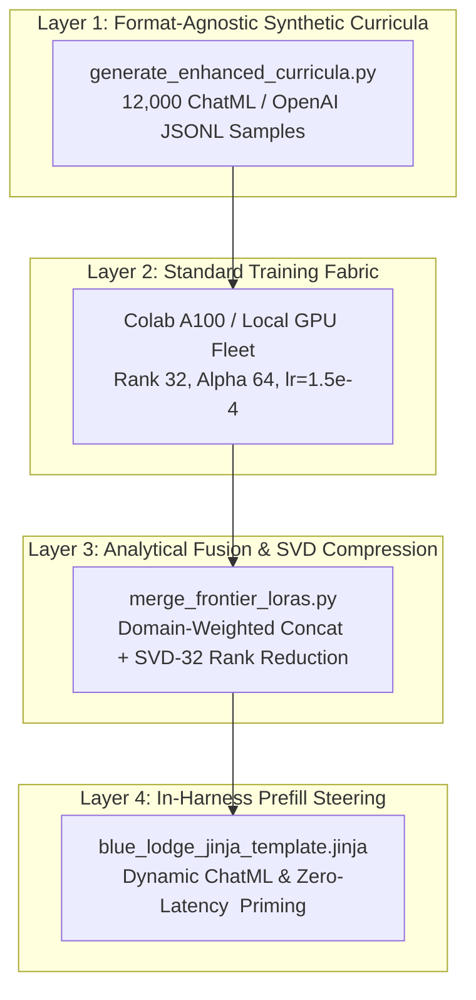
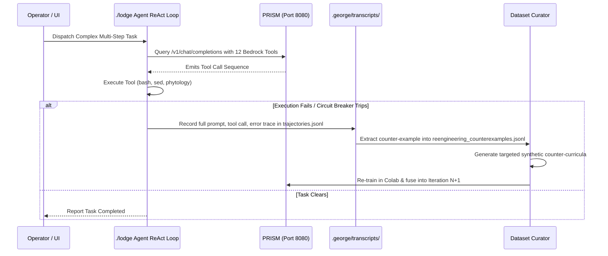

# 🏛️ Blue Lodge Sovereign Model Expansion & Continuous Fine-Tuning Playbook

This document defines how to operate, configure, preserve, and generalize the **Blue Lodge Agentic Fine-Tuning & In-Harness Calibration Pipeline** to other open-weights foundation models.

---

## 1. Operating the Calibrated Model as the Primary Engine

The primary Blue Lodge agent architecture is decoupled into two tiers:
- **Tier 1 (Port 8080):** Text-first sovereign inference engine with full 12-tool bedrock execution and dynamic ChatML steering.
- **Tier 2 (Port 18080):** Multimodal / worker inference engine with vision tower support.

### Permanent Configuration Anchors
The primary inference engine is configured in [`docker-compose.yml`](file:///home/wsl-ops/blue-lodge/docker-compose.yml) and launched via [`scripts/start_prism.sh`](file:///home/wsl-ops/blue-lodge/scripts/start_prism.sh):

```yaml
services:
  prism-inference:
    container_name: george-prism-server
    environment:
      - LLAMA_ARG_MODEL=/models/frontier_qwen38/Blue-Llama-27B-Champion-v5-Internal-MTP-Calibrated.gguf
      - LLAMA_ARG_LORA=/models/frontier_qwen38/Blue-Llama-27B-Champion-v5-Iteration8-Fused-LoRA.gguf
      - LLAMA_ARG_REASONING_EFFORT=low
      - LLAMA_ARG_CTX_SIZE=131072
      - LLAMA_ARG_PORT=8080
    volumes:
      - ${MODELS_DIR:-/home/wsl-ops/models}:/models:ro
      - ./configs/blue_lodge_jinja_template.jinja:/models/frontier_qwen38/blue_lodge_jinja_template.jinja:ro
```

### Applying or Switching Adapters
To update or restart the primary engine after creating new adapters:
```bash
# 1. Update the Jinja template on host
cp configs/blue_lodge_jinja_template.jinja /home/wsl-ops/models/frontier_qwen38/blue_lodge_jinja_template.jinja

# 2. Restart the inference server
docker restart george-prism-server

# 3. Verify health and readiness
curl -s http://127.0.0.1:8080/health
```

All Blue Lodge entrypoints (`./lodge`, `web/src/main.rs`, `lib/react.sh`, `lib/agent.sh`) route directly to `http://127.0.0.1:8080` by default.

---

## 2. Preserving & Retuning Other Foundation Models

The success of the 100% benchmark run does **not** depend on the specific quantization of the 27B model. The architecture is built as 4 fully decoupled, model-agnostic layers:



### How to Apply This to Other Models (e.g., Qwen 2.5 32B/72B, Llama 3.1 70B, DeepSeek-Coder, Gemma 2):

1. **Dataset Portability:**
   - [`data/training/enhanced_syntax_train.jsonl`](file:///home/wsl-ops/blue-lodge/data/training/enhanced_syntax_train.jsonl)
   - [`data/training/enhanced_fileops_train.jsonl`](file:///home/wsl-ops/blue-lodge/data/training/enhanced_fileops_train.jsonl)
   - [`data/training/enhanced_phytology_gitops_train.jsonl`](file:///home/wsl-ops/blue-lodge/data/training/enhanced_phytology_gitops_train.jsonl)
   These use pure OpenAI/ChatML standard dictionaries (`{"messages": [{"role": "system", ...}, {"role": "user", ...}, {"role": "assistant", ...}]}`). They can be ingested directly by **Unsloth, Axolotl, LLaMA-Factory, TRL, or torchtune** without converting a single token.

2. **Training Hyperparameter Standard:**
   - **LoRA Targets:** All projection and MLP matrices (`q_proj`, `k_proj`, `v_proj`, `o_proj`, `gate_proj`, `up_proj`, `down_proj`).
   - **Geometry:** `r = 32`, `alpha = 64.0` (Scaling factor $\alpha / r = 2.0$).
   - **Optimizer:** AdamW, $\beta_1 = 0.9$, $\beta_2 = 0.95$, weight decay $0.01$, learning rate $1.5 \times 10^{-4}$.
   - **Loss Function:** Directional feature-contrastive policy loss penalizing preliminary `file_read` when `file_edit` is requested, and zero-tolerance penalties on XML leaks.

3. **Multi-Adapter Weighting Policy:**
   When training modular adapters across domains, never fuse them with equal weights:
   - **Domain Remediation Stacks:** **90%** total authority (FileOps 40%, Syntax 25%, GitOps/Phytology 25%).
   - **Cognitive Reasoning Anchors:** **10%** regularization authority (math/logic anchors like GPQA or ARC).

4. **Template Porting:**
   Any base model with a reasoning token (like `<think>`) or standard assistant header can adopt the dynamic steering pattern in [`blue_lodge_jinja_template.jinja`](file:///home/wsl-ops/blue-lodge/configs/blue_lodge_jinja_template.jinja):
   - Replace open-ended deliberation with closed prefilled intents (`<think>\nI will invoke ...\n</think>\n\n`).
   - This prevents open-weights models from generating 1,500 tokens of monologue before deciding to call a tool.

---

## 3. The Continuous Failure-Harvesting Loop (Active Learning)

To test the model on complex real-world tasks and automatically mine new training datasets from failures:



### Running Real Tasks in Blue Lodge
You can execute complex tasks through:
1. **Interactive Shell:** Run `./lodge` and type your goal.
2. **Headless One-Shot:**
   ```bash
   ./lodge "Refactor lib/limits.sh to adjust circuit breaker thresholds and verify tests pass."
   ```
3. **Automated Audit Pipeline:**
   ```bash
   ./lodge "/phytology audit --cached"
   ```

### Harvesting Trajectories
- Every turn is recorded in `.george/transcripts/trajectories.jsonl`.
- If an agent turn encounters a failure, the prompt and mismatch are captured in [`data/training/reengineering_counterexamples.jsonl`](file:///home/wsl-ops/blue-lodge/data/training/reengineering_counterexamples.jsonl).
- Running [`scripts/colab_training/generate_enhanced_curricula.py`](file:///home/wsl-ops/blue-lodge/scripts/colab_training/generate_enhanced_curricula.py) incorporates these counter-examples into the next training cycle automatically.
