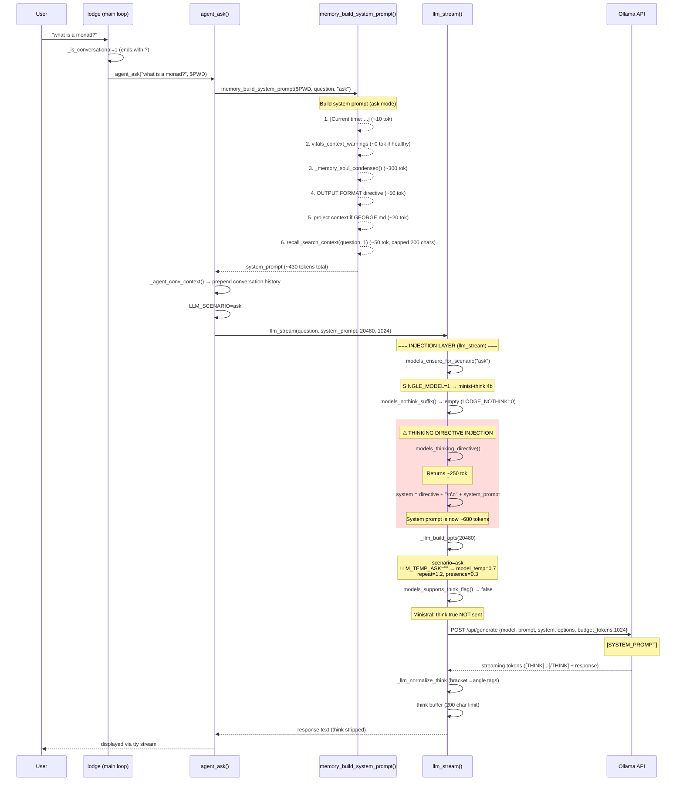
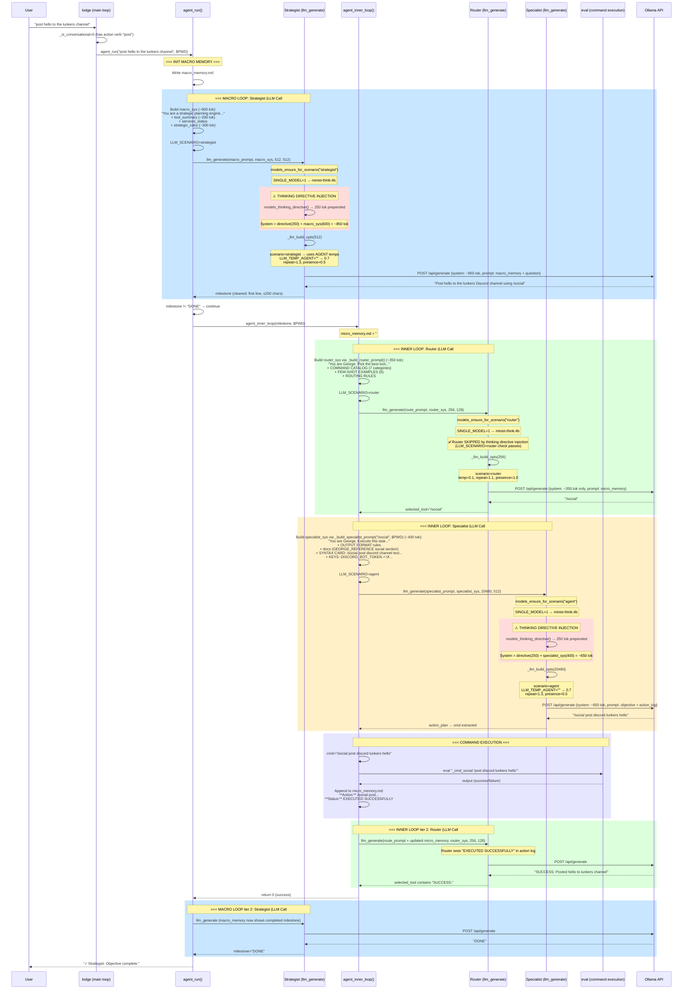
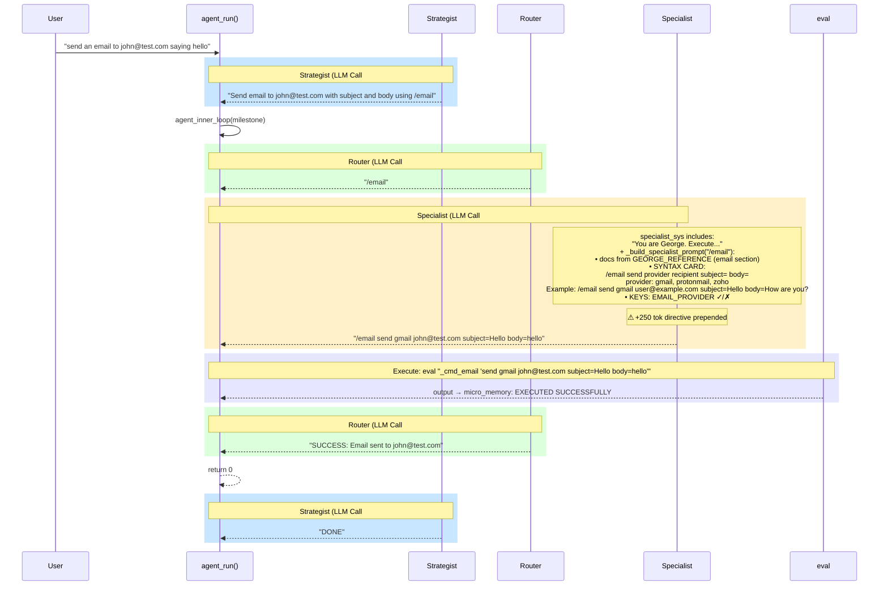
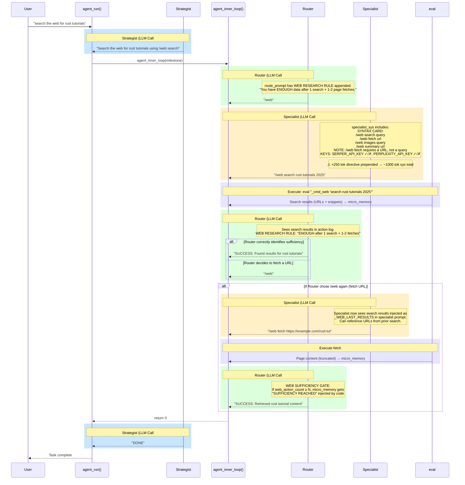

# LLM Call Maps — Sequence Diagrams

> Generated 2026-02-27 from code audit of `lib/agent.sh`, `lib/llm.sh`, `lib/memory.sh`, `lib/models.sh`, `lodge`

These diagrams trace every LLM call, what gets injected into each prompt layer, and how calls chain together for key slash commands.

**Current configuration** (HEAD on `issue/model_degradation`):
- `LODGE_SINGLE_MODEL=1` → all scenarios use **minist-think:4b** (reasoning model)
- `LLM_TEMP_ASK=` (empty → falls through to model registry = **0.7**)
- `LLM_TEMP_AGENT=` (empty → **0.7**)
- `LLM_TEMP_ROUTER=0.1`
- `LLM_TEMP_TOOL=` (empty → **0.7**)
- `repeat_penalty=1.2`, `presence_penalty=0.3` (model registry defaults)
- `models_thinking_directive()` returns **~250 tokens** (Unsloth preamble + George identity) for minist-think
- Modelfile SYSTEM already contains the **same ~250 tokens** baked in

---

## 1. `/ask` — Simple Question Path

The simplest path. One LLM call, no agent loop.

### 1.1 Sequence Diagram



### 1.2 What the Model Actually Sees

```
[SYSTEM_PROMPT]
# HOW YOU SHOULD THINK AND ANSWER                          ← injected by models_thinking_directive() (~250 tok)
First draft your thinking process...
[THINK]Your thoughts...[/THINK]Here, provide a response.
# WHO YOU ARE
You ARE George — three souls reincarnated into one...
When asked to skip reasoning, respond directly...
From the rough ashlar to the perfect — this is the work.

[Current time: Thursday, February 27, 2026 14:30 EST]     ← from memory_build_system_prompt()
# IDENTITY                                                 ← _memory_soul_condensed() (~300 tok)
You ARE George — three souls reincarnated into one:
Washington's iron discipline, Franklin's restless wit...
# PERSONALITY
You don't crack jokes when the build is on fire...
# CORE RULES
1. Be Praiseworthy...
2. Be Concise...
3. Format...
4. Tool First...

OUTPUT FORMAT: You are answering a direct question...      ← format directive (~50 tok)
[/SYSTEM_PROMPT]
[INST]what is a monad?[/INST]
```

**Total system prompt: ~680 tokens. Identity appears TWICE.**

### 1.3 Parameter Summary

| Parameter | Value | Source | Good-commit value |
|---|---|---|---|
| model | minist-think:4b | SINGLE_MODEL=1 | minist-think:4b |
| temperature | **0.7** | LLM_TEMP_ASK="" → registry | **0.5** |
| repeat_penalty | 1.2 | LLM_REPEAT_ASK=1.2 | 1.3 |
| presence_penalty | 0.3 | LLM_PRESENCE_ASK=0.3 | 0.8 |
| budget_tokens | 1024 | LLM_BUDGET_ASK | 1024 |
| num_predict | 20480 | LLM_ASK_TOKENS | 20480 |
| think:true | **not sent** | models_supports_think_flag=false | was sent (models_has_thinking=true) |
| system tokens | **~680** | directive(250) + ask(430) | **~430** (no directive injection) |

### 1.4 Issues Identified

1. **Identity duplication** — `models_thinking_directive()` includes "# WHO YOU ARE / You ARE George..." AND `_memory_soul_condensed()` includes "# IDENTITY / You ARE George..." — the model reads George's identity twice in the same system prompt.
2. **Temperature 0.7 vs 0.5** — Ask scenario lost its dedicated temp override. At 0.7, answers are more random/verbose.
3. **Presence penalty dropped 0.8→0.3** — Less anti-repetition for conversational output.
4. **250 tokens of overhead** — The thinking directive is pure overhead for `/ask` since the Modelfile SYSTEM already contains it. When Ollama receives a runtime `system` parameter, it REPLACES the Modelfile SYSTEM — but now the directive is manually re-injected, plus the condensed soul adds its own identity. Net: +250 tokens of duplicated content.

---

## 2. `/social` — Agent Loop Path (e.g., "post hello to the lunkers channel")

Full agent loop: strategist → router → specialist → execute → loop.

### 2.1 Sequence Diagram



### 2.2 LLM Call Summary Table

| # | Role | Function | Scenario | Model | Temp | System Tokens | Directive Injected? | Budget |
|---|---|---|---|---|---|---|---|---|
| 1 | Strategist | llm_generate | strategist | minist-think | **0.7** | **~850** | **YES (+250)** | 512 |
| 2 | Router | llm_generate | router | minist-think | 0.1 | ~350 | NO (skipped) | 128 |
| 3 | Specialist | llm_generate | agent | minist-think | **0.7** | **~650** | **YES (+250)** | 512 |
| 4 | Router | llm_generate | router | minist-think | 0.1 | ~350 | NO | 128 |
| 5 | Strategist | llm_generate | strategist | minist-think | **0.7** | **~850** | **YES (+250)** | 512 |

**Total LLM calls for simple social post: 5** (min case: success on first try)

### 2.3 Issues Identified

1. **Strategist at temp=0.7** — Should be deterministic (was 0.3). At 0.7, milestones are verbose and unpredictable.
2. **Specialist at temp=0.7** — Generates exact slash commands. At 0.7, hallucinations in command syntax are common.
3. **Thinking directive on strategist** — Strategist prompt is "strategic planning engine" + tool list. The 250-token Unsloth preamble with identity is irrelevant here.
4. **Thinking directive on specialist** — Specialist needs to output one command. The identity/thinking preamble is wasted tokens.
5. **5 LLM calls minimum** for a simple action — this was the same at the good commit, not a regression.

---

## 3. `/email` — Agent Loop Path (e.g., "send an email to john@test.com saying hello")

Same agent loop structure as `/social`, but with the email-specific specialist syntax card.

### 3.1 Sequence Diagram



### 3.2 Email-Specific Complexity

The email specialist has a unique parsing challenge:

```
/email send gmail john@test.com subject=Hello there body=How are you today?
```

The email parser in `_cmd_email` must parse:
- `provider` = gmail (positional arg 1)
- `recipient` = john@test.com (positional arg 2)  
- `subject=` captures through next `key=` or end
- `body=` captures rest

**Failure mode at temp=0.7**: The specialist may generate:
- `/email send john@test.com gmail subject=Hello body=hi` (wrong arg order)
- `/email send gmail john@test.com "Hello" "How are you"` (quoted args — parser doesn't handle)
- `/email send gmail to=john@test.com subject=Hello body=hi` (unnecessary `to=` prefix)

At temp=0.3 (good commit), the specialist reliably follows the syntax card.

### 3.3 Parameter Table

| # | Role | Temp | Sys Tokens | Directive? | Old Temp |
|---|---|---|---|---|---|
| 1 | Strategist | **0.7** | ~850 | YES | **0.3** |
| 2 | Router | 0.1 | ~350 | NO | 0.1 |
| 3 | Specialist | **0.7** | ~700 | YES | **0.3** |
| 4 | Router | 0.1 | ~350 | NO | 0.1 |
| 5 | Strategist | **0.7** | ~850 | YES | **0.3** |

---

## 4. `/web` — Agent Loop Path (e.g., "search the web for rust tutorials")

Same agent loop, but web commands often produce **multi-iteration inner loops** (search → fetch → summarize).

### 4.1 Sequence Diagram



### 4.2 Web-Specific Failure Modes

The web path is the most LLM-call-intensive because:
1. **Search → Fetch spiral**: Router often decides to fetch every URL from search results instead of declaring SUCCESS
2. **Specialist syntax confusion at 0.7**: The specialist may generate `/web rust tutorials` (missing `search` subcommand) or `/web search "rust tutorials"` (quoted args fail)
3. **Sufficiency gate**: Code-level gate counts web actions and injects "SUFFICIENCY REACHED" into micro_memory after N actions — but the router at temp=0.1 may still not output SUCCESS

### 4.3 LLM Call Count Comparison

| Path | Min Calls | Typical Calls | Max Calls |
|---|---|---|---|
| Best case (search → SUCCESS) | 5 | — | — |
| Search + 1 fetch | 7 | 7-9 | — |
| Search + fetch spiral | — | — | 15+ (3 inner × max loops) |

### 4.4 Parameter Table

| # | Role | Temp | Sys Tokens | Directive? | Old Temp |
|---|---|---|---|---|---|
| 1 | Strategist | **0.7** | ~850 | YES | **0.3** |
| 2 | Router | 0.1 | ~350 | NO | 0.1 |
| 3 | Specialist | **0.7** | ~1000 | YES | **0.3** |
| 4 | Router | 0.1 | ~350 | NO | 0.1 |
| 5 | Specialist | **0.7** | ~1000 | YES | **0.3** |
| 6 | Router | 0.1 | ~350 | NO | 0.1 |
| 7 | Strategist | **0.7** | ~850 | YES | **0.3** |

---

## 5. Comparative Summary

### 5.1 What Changed Since Good Commit (3198759)

| Dimension | Good Commit | Current HEAD | Impact |
|---|---|---|---|
| **Ask temp** | 0.5 | 0.7 (+0.2) | More random answers |
| **Agent/Specialist temp** | 0.3 | 0.7 (+0.4) | Command syntax hallucination |
| **Strategist temp** | 0.3 (agent) | 0.7 (strategist→agent fallthrough) | Verbose/wrong milestones |
| **System prompt overhead** | 0 extra | +250 tok per non-router call | Attention dilution |
| **Identity repetition** | 1× (Modelfile OR condensed_soul) | 2× (directive + condensed_soul) | Confusion |
| **Modelfile SYSTEM** | ~85 tok (lean) | ~220 tok (Unsloth preamble) | Larger base |
| **repeat_penalty** | 1.0 (think), 1.3 (global) | 1.2 (think+global) | Vocabulary suppression |
| **presence_penalty** | 0.0 (think), 0.8 (global) | 0.3 (think+global) | Less anti-repetition |
| **think:true flag** | Sent to all thinkers | Only qwen3/granite4 | Ministral thinking changes |
| **Model routing** | Dual (think+inst) | Single (think only) | No fast instruct path |

### 5.2 Token Budget Per Call (System Prompt)

```
GOOD COMMIT:                          CURRENT HEAD:
┌──────────────────────┐              ┌──────────────────────┐
│ /ask system: ~430 tok│              │ /ask system: ~680 tok│
│  • time         (10) │              │  • directive   (250) │ ← NEW
│  • condensed   (200) │              │  • time         (10) │
│  • format       (50) │              │  • condensed   (300) │ ← was 200
│  • project      (20) │              │  • format       (50) │
│  • recall       (50) │              │  • project      (20) │
│  • [no overhead]     │              │  • recall       (50) │
└──────────────────────┘              └──────────────────────┘

┌──────────────────────┐              ┌──────────────────────┐
│ specialist: ~250 tok │              │ specialist: ~650 tok │
│  • role         (30) │              │  • directive   (250) │ ← NEW
│  • format rules (50) │              │  • role         (30) │
│  • docs        (100) │              │  • format rules (50) │
│  • hints        (30) │              │  • docs        (100) │
│  • [no overhead]     │              │  • syntax card (100) │ ← NEW
└──────────────────────┘              │  • keys         (20) │ ← NEW
                                      └──────────────────────┘

┌──────────────────────┐              ┌──────────────────────┐
│ strategist: ~400 tok │              │ strategist: ~850 tok │
│  • role         (30) │              │  • directive   (250) │ ← NEW
│  • commands     (80) │              │  • role         (30) │
│  • rules       (250) │              │  • commands    (200) │ ← was 80
│  • [no overhead]     │              │  • rules       (350) │ ← was 250
└──────────────────────┘              └──────────────────────┘

┌──────────────────────┐              ┌──────────────────────┐
│ router: ~250 tok     │              │ router: ~350 tok     │
│  • catalog     (200) │              │  • catalog     (250) │
│  • rules        (50) │              │  • few-shot     (50) │ ← NEW
│  [no directive]      │              │  • rules        (50) │
└──────────────────────┘              │  [no directive]      │ ← CORRECT
                                      └──────────────────────┘
```

### 5.3 The `/ask` Fix Priorities

Since `/ask` is the simplest path with a single LLM call, fixes here prove out before percolating:

1. **Restore `LLM_TEMP_ASK=0.5`** — Direct fix, one line
2. **Stop injecting thinking directive into ask** — The condensed soul already covers identity. The Unsloth thinking preamble is redundant when the model already knows to think from its Modelfile training.
3. **Or: slim the directive to thinking-only** — If injection must stay, strip the "# WHO YOU ARE" identity block from it (keep only the 3-line thinking instruction)
4. **Restore penalties** — `repeat_penalty=1.0, presence_penalty=0.0` for the Modelfile (thinking model), keep scenario overrides as-is
