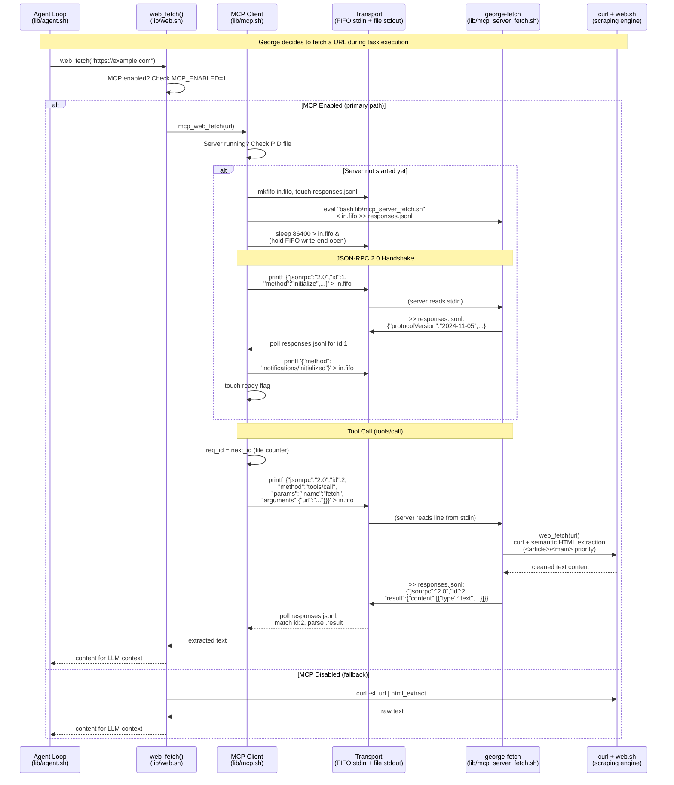

# MCP Integration — Model Context Protocol Client

George includes a pure-bash MCP client for connecting to external tool
servers. No Python bridge, no Node.js runtime — just bash + jq over stdio.

The client itself has **zero dependencies beyond bash and jq**. Any
process that speaks MCP (JSON-RPC 2.0 over stdin/stdout) works as a
server — Python, Go, Rust, even another bash script. George ships with
a **built-in pure-bash MCP fetch server** (`george-fetch`) that reuses
the `web.sh` scraping engine — no Node.js, no Python, no external
runtime needed.

## Prerequisites

- **jq** (or gojq): Required for JSON-RPC parsing. Install with
  `apt install jq` or `brew install jq`.
- **For catalog servers only**: The default catalog entries use `npx`
  (Anthropic's MCP servers are Node packages). If you only use custom
  non-Node servers, Node.js is not needed at all.
- **Environment variables**: Some catalog servers require API keys —
  `BRAVE_API_KEY` for brave-search, `GITHUB_TOKEN` for github.
  Export these before starting lodge.

## Quick Start

```
/mcp on                           # Enable MCP integration
/mcp install george-fetch         # Register built-in fetch server (pure bash)
/mcp start george-fetch           # Start the server (handshake + ready)
/mcp tools george-fetch           # List available tools
/mcp call george-fetch fetch '{"url":"https://example.com"}'
```

## How It Works

**Architecture**: FIFO for server stdin + regular file for stdout.
Avoids named-pipe deadlocks in subshells. Background `sleep` process
holds the FIFO write end open so the server doesn't get EOF.

**Protocol**: JSON-RPC 2.0 over stdio, per the MCP specification.
Initialize handshake → tools/list → tools/call.

**Auto-Start**: When you call a tool or list tools for a registered
server that isn't running, George auto-starts it. You only need
explicit `/mcp start` if you want to pre-warm the connection.

**MCP-First Dispatch**: When MCP is enabled and a running server has a
tool matching a slash command name, George tries the MCP tool first.
On failure, it falls back to native slash commands.

**Web Fetch Priority**: When MCP is on, `web_fetch()` tries MCP servers
in order: `george-fetch` (built-in, pure bash) → `fetch` (Anthropic's
Node.js server) → `puppeteer` (headless browser) → curl fallback.

**Persistence**: Server registrations (`servers.conf`) persist across
sessions. Running servers do not — they're killed on exit and must be
started again (or will auto-start on first use).

## Sequence Diagram: Agent Loop → MCP Client → george-fetch

This shows the full path when George's agent loop needs to fetch a URL.
The LLM strategist decides to call `web_fetch`, which routes through the
MCP client to the pure-bash george-fetch server — all over stdio FIFOs
within the same shell session:



### How the Transport Works (and Why It's This Way)

The transport layer is the critical difference between George's
implementation and every other MCP client on the planet. Here's
what's actually happening at the file descriptor level:

```
┌──────────────┐      ┌──────────────┐      ┌──────────────────┐
│  MCP Client  │      │   Kernel     │      │  george-fetch    │
│  (mcp.sh)    │      │              │      │  (bash process)  │
│              │      │              │      │                  │
│  printf ──────────► │  in.fifo     │ ────►│  stdin (read)    │
│  (atomic     │      │  (named pipe)│      │                  │
│   < PIPE_BUF)│      │              │      │                  │
│              │      │              │      │                  │
│  poll ◄──────────── │ responses    │ ◄────│  stdout (append) │
│  (tail -c,   │      │ .jsonl       │      │  (>> regular     │
│   grep id)   │      │ (regular     │      │   file)          │
│              │      │  file)       │      │                  │
│  sleep 86400 ─────► │  (holds FIFO │      │                  │
│  (keeper)    │      │   open)      │      │                  │
└──────────────┘      └──────────────┘      └──────────────────┘
```

**Why not two FIFOs?** (the obvious approach)

Most MCP clients use bidirectional pipes or paired FIFOs. George
tried this first — it deadlocked. Here's why:

```bash
# This deadlocks in bash:
response=$(cat < response.fifo)   # $() forks a subshell
                                  # subshell blocks on FIFO read
                                  # parent never sends the request
                                  # because it's waiting for $() to finish
```

`$()` command substitution in bash forks a new process. If that
subprocess tries to read a FIFO, it blocks — and the parent process
that would trigger the write is suspended waiting for the subshell.
Classic deadlock.

**The solution**: Write to a FIFO (for the request — atomic, < PIPE_BUF),
but read from a regular file (for the response — `tail -c` + poll loop,
no blocking). The server appends JSON-RPC responses to `responses.jsonl`.
The client polls the file size, reads new bytes, and scans for a matching
`"id"` field. No race conditions, no deadlocks, works from any subshell
depth.

**Why the `sleep 86400` keeper process?**

A FIFO closes when the last writer hangs up. Between requests, the MCP
client isn't writing — so the FIFO would close and the server would see
EOF on stdin and exit. A `sleep 86400` process holds the write end of the
FIFO open for 24 hours, keeping the server alive between requests.

### George's Pure Bash vs. Anthropic's TypeScript SDK

Anthropic publishes a [TypeScript MCP SDK](https://github.com/modelcontextprotocol/typescript-sdk)
that most MCP clients are built on. Here's how George's pure-bash
implementation compares:

| Aspect | George (pure bash) | Anthropic TypeScript SDK |
|---|---|---|
| **Runtime** | bash + jq (already installed) | Node.js 18+ (200MB+) |
| **Dependencies** | 0 (jq is the only requirement) | ~40 npm packages |
| **Transport** | FIFO stdin + regular file stdout | Node Streams / stdio |
| **Startup time** | ~50ms (fork bash + jq) | ~800ms (Node.js cold start) |
| **Memory** | ~2MB (bash process) | ~50-80MB (V8 heap) |
| **Subshell safe?** | Yes (file-based transport) | N/A (single process) |
| **Protocol coverage** | initialize, tools/list, tools/call | Full spec + SSE + sampling |
| **Bash 3.2 compatible?** | Yes (macOS default bash) | No (not bash) |
| **Server registry** | Flat file (`name\|cmd\|desc`) | JSON config file |
| **Tool caching** | LRU file cache (lib/cache.sh) | In-memory |
| **Concurrent servers** | Yes (separate FIFO per server) | Yes (separate connections) |

**What George doesn't implement** (intentionally):
- SSE (Server-Sent Events) transport — stdio is sufficient for local servers
- Sampling/completion requests — George has its own LLM pipeline
- Resource subscriptions — not needed for tool-calling use case
- Prompt templates — George uses its own prompt architecture

**What George does that the SDK doesn't**:
- Survives bash subshells (the file-based transport is fork-safe)
- Runs on bash 3.2 (macOS ships bash 3.2 due to GPLv3)
- Zero-dependency install (no npm, no package.json)
- LRU-cached tool catalogs that persist across subshells
- MCP-first dispatch intercept (transparent to the agent loop)
- Built-in server catalog with one-command install (`/mcp install fetch`)

The SDK is more complete — it implements the full MCP spec. George
implements exactly the subset needed to discover and call tools from
the agent loop, in a language where every `$()` is a potential fork
bomb for stateful protocols.

## Commands

| Command | Description |
|---|---|
| `/mcp` | Show status overview |
| `/mcp on` / `/mcp off` | Enable/disable MCP |
| `/mcp add <name> <cmd>` | Register a custom server |
| `/mcp remove <name>` | Unregister a server |
| `/mcp list` | List registered servers |
| `/mcp catalog` | Browse recommended servers |
| `/mcp install <name>` | Install from catalog |
| `/mcp start <name>` | Start a server |
| `/mcp stop [name\|all]` | Stop server(s) |
| `/mcp tools [name]` | List tools from server(s) |
| `/mcp call <srv> <tool> [json]` | Call an MCP tool directly |
| `/mcp cache [clear]` | View/clear tool cache |

## Adding Custom Servers

Register any MCP-compatible server with `/mcp add`. The server can be
written in any language — it just needs to speak JSON-RPC 2.0 over
stdin/stdout:

```
/mcp add myserver "python3 -m my_mcp_server"
/mcp add local-tools "bash /path/to/my_tools.sh"
/mcp add go-server "/usr/local/bin/my-mcp-server --flag"
```

George will `eval` the command, so arguments and flags work normally.
Server names must be alphanumeric with hyphens/underscores.

**Limitation**: The `|` pipe character in commands will break the
internal registry format. If your server command needs pipes, wrap it
in a shell script and register the script path instead.

## Built-in Server: george-fetch

George ships with a pure-bash MCP fetch server that reuses the existing
`web.sh` scraping engine. No Node.js, no Python — just bash + curl + jq.

**Install**: `/mcp install george-fetch`

### Tools

| Tool | Description |
|---|---|
| `fetch` | Fetch a URL → clean extracted text (semantic HTML, PDF, JSON, XML) |
| `fetch_json` | Fetch a URL → structured JSON (title, content, images) |
| `fetch_pdf` | Fetch a PDF URL → extracted text (pdftotext / strings fallback) |
| `web_search` | Search the web (DDG, Serper, Perplexity) |
| `web_images` | Image search (requires `SERPER_API_KEY`) |
| `github_search` | Search GitHub repositories (no auth needed) |

### Compared to @anthropic/mcp-server-fetch

| Feature | george-fetch | Anthropic fetch |
|---|---|---|
| Runtime | bash + curl | Node.js |
| HTML extraction | Semantic (`<article>`/`<main>` priority) | Readability.js |
| Anti-bot detection | Built-in blacklist + retry | robotstxt check |
| PDF extraction | pdftotext with strings fallback | Not supported |
| Web search | DDG / Serper / Perplexity | Not included |
| Image search | Serper images | Not included |
| GitHub search | GitHub API | Not included |
| JS rendering | Not supported | Not supported |
| Caching | George LRU cache | None |

For JS-rendered pages, install the `puppeteer` server alongside
`george-fetch` — George will try `george-fetch` first, then fall back
to puppeteer for pages that need a headless browser.

## Server Catalog (optional, requires Node.js)

The built-in catalog also includes Anthropic's official MCP servers for
additional capabilities. These use `npx` and require Node.js — but Node
is only needed if you install these specific entries. For most use cases,
`george-fetch` alone is sufficient:

| Server | Command | Description |
|---|---|---|
| `george-fetch` | `bash lib/mcp_server_fetch.sh` | **Built-in** web fetch (pure bash, no Node.js) |
| `fetch` | `npx -y @anthropic/mcp-server-fetch` | Web content fetching (enhanced scraping) |
| `puppeteer` | `npx -y @anthropic/mcp-server-puppeteer` | Browser automation for JS-rendered pages |
| `brave-search` | `npx -y @anthropic/mcp-server-brave-search` | Brave web search (needs `BRAVE_API_KEY`) |
| `github` | `npx -y @anthropic/mcp-server-github` | GitHub operations (needs `GITHUB_TOKEN`) |
| `filesystem` | `npx -y @anthropic/mcp-server-filesystem .` | Local filesystem (scoped to current dir) |
| `sqlite` | `npx -y @anthropic/mcp-server-sqlite` | SQLite database queries |
| `memory` | `npx -y @anthropic/mcp-server-memory` | Knowledge graph memory |
| `everything` | `npx -y @anthropic/mcp-server-everything` | Testing/demo server (all tool types) |

Install from catalogwith `/mcp install <name>`, then `/mcp start <name>`.

## Configuration

| Variable | Default | Description |
|---|---|---|
| `MCP_ENABLED` | `0` | Master toggle (0=off, 1=on) |
| `MCP_TIMEOUT` | `30` | Seconds to wait for server response |
| `MCP_CONFIG_DIR` | `$GEORGE_DIR/mcp` | Server registry + catalog (persists) |
| `MCP_RUN_DIR` | `/tmp/.lodge-mcp-<PID>` | Runtime FIFOs, responses, PIDs (ephemeral) |

## Integration Points

- **`lib/mcp.sh`** — Complete MCP client library
- **`lib/mcp_server_fetch.sh`** — Built-in pure-bash MCP fetch server (george-fetch)
- **`lib/web.sh`** — MCP-first fetch in `web_fetch()`, falls back to curl
- **`lib/commands.sh`** — MCP dispatch intercept before normal routing
- **`lodge`** — `/mcp` command registration, source chain, exit cleanup

## Tool Caching

Tool lists from servers are cached via `lib/cache.sh` (LRU) using the
`mcp` namespace. This avoids re-querying `tools/list` on every call.
Clear with `/mcp cache clear`.

## Bash 3.2 Compatibility

The implementation avoids bash 4+ features:
- No associative arrays (flat file registry: `servers.conf`)
- No coproc (FIFO + file approach)
- No `{fd}>` fd assignment (detached sleep process)

## Troubleshooting

**Server won't start**: Check `$MCP_RUN_DIR/<name>/stderr.log` for errors.
Most MCP servers require Node.js/npx installed.

**Handshake timeout**: The server may need longer to start (npm install on
first run). Try again — npx caches packages after first use.

**No tools returned**: Ensure the server is started (`/mcp start <name>`)
and the tool cache isn't stale (`/mcp cache clear`).

**brave-search / github fails**: These need environment variables set
before starting lodge: `export BRAVE_API_KEY=...` or `export GITHUB_TOKEN=...`.

**Stale processes after crash**: If lodge crashes, MCP server processes
may linger. Kill them with `pkill -f mcp-server` or check for orphaned
`sleep 86400` processes.

## Attribution

- MCP protocol: [Anthropic](https://modelcontextprotocol.io)
- Pure-bash MCP feasibility validated by:
  [yaniv-golan/mcp-bash-framework](https://github.com/yaniv-golan/mcp-bash-framework) (MIT)
- George's MCP client is an original implementation.
