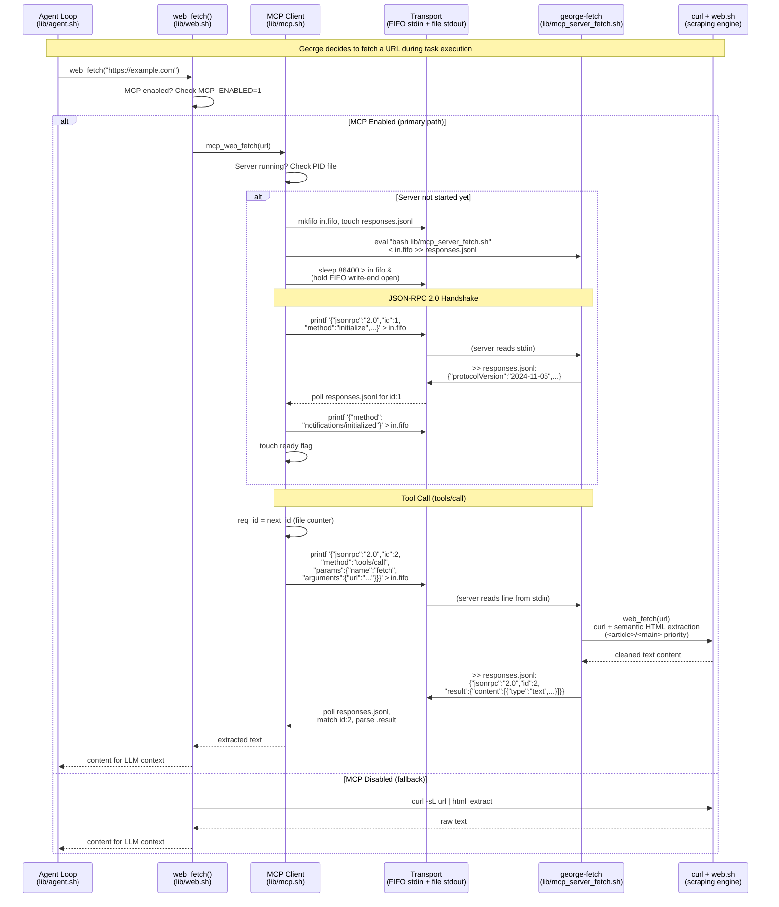

# MCP Integration — Model Context Protocol Client

George includes a pure-bash MCP client for connecting to external tool
servers. No Python bridge, no Node.js runtime — just bash + jq over stdio.

The client itself has **zero dependencies beyond bash and jq**. Any
process that speaks MCP (JSON-RPC 2.0 over stdin/stdout) works as a
server — Python, Go, Rust, even another bash script. George ships with
two **built-in pure-bash MCP servers**:
- **`george-fetch`** — Web scraping, search, and PDF extraction (reuses `web.sh`)
- **`george-git`** — Git operations and GitHub search (reuses `git.sh`)

No Node.js, no Python, no external runtime needed.

## Prerequisites

- **jq** (or gojq): Required for JSON-RPC parsing. Install with
  `apt install jq` or `brew install jq`.
- **For catalog servers only**: The default catalog entries use `npx`
  (Anthropic's MCP servers are Node packages). If you only use custom
  non-Node servers, Node.js is not needed at all.
- **Environment variables**: Some catalog servers require API keys —
  `BRAVE_API_KEY` for brave-search, `GITHUB_TOKEN` for github.
  Export these before starting lodge.

## Quick Start

```
/mcp on                           # Enable MCP integration
/mcp install george-fetch         # Register built-in fetch server (pure bash)
/mcp install george-git           # Register built-in git server (pure bash)
/mcp start george-fetch           # Start the server (handshake + ready)
/mcp tools george-fetch           # List available tools
/mcp call george-fetch fetch '{"url":"https://example.com"}'
/mcp call george-git git_status   # Show working tree status
```

## How It Works

**Architecture**: FIFO for server stdin + regular file for stdout.
Avoids named-pipe deadlocks in subshells. Background `sleep` process
holds the FIFO write end open so the server doesn't get EOF.

**Protocol**: JSON-RPC 2.0 over stdio, per the MCP specification.
Initialize handshake → tools/list → tools/call.

**Auto-Start**: When you call a tool or list tools for a registered
server that isn't running, George auto-starts it. You only need
explicit `/mcp start` if you want to pre-warm the connection.

**MCP-First Dispatch**: When MCP is enabled and a running server has a
tool matching a slash command name, George tries the MCP tool first.
On failure, it falls back to native slash commands. This includes
**compound command matching**: `/git status` maps to tool `git_status`,
`/git branch` maps to `git_branch`, etc. The client concatenates the
command and subcommand with an underscore, then searches for a matching
tool name across all running servers.

**Web Fetch Priority**: When MCP is on, `web_fetch()` tries MCP servers
in order: `george-fetch` (built-in, pure bash) → `fetch` (Anthropic's
Node.js server) → `puppeteer` (headless browser) → curl fallback.

**Persistence**: Server registrations (`servers.conf`) persist across
sessions. Running servers do not — they're killed on exit and must be
started again (or will auto-start on first use).

## Server Lifecycle: Install → Start → In Memory → Stop

This is how an MCP server goes from a catalog entry to a running
process in memory, and what it looks like while it's alive.

### 1. Install (Registration)

When you run `/mcp install george-git`, George reads the catalog
(`$MCP_CONFIG_DIR/catalog.conf`) and writes a line to the server
registry (`$MCP_CONFIG_DIR/servers.conf`):

```
# servers.conf — one line per registered server
# Format: name|command|description
george-git|bash /home/user/blue-lodge/lib/mcp_server_git.sh|Built-in git & GitHub operations (pure bash, no Node.js)
george-fetch|bash /home/user/blue-lodge/lib/mcp_server_fetch.sh|Built-in web fetch (pure bash, no Node.js)
```

The server is NOT started yet. It's just registered. This file persists
across sessions — you only install once.

Internally, `mcp_server_add()` in `lib/mcp.sh` validates the name
(alphanumeric + hyphens), removes any existing entry, and appends
the new `name|command|description` line.

### 2. Start (Process Launch + Handshake)

When you run `/mcp start george-git` (or any tool is called for an
unstarted server — auto-start), `mcp_start()` does this:

```
Step 1: Create runtime directory
  mkdir -p /tmp/.lodge-mcp-<PID>/george-git/

Step 2: Create transport files
  mkfifo  .../george-git/in.fifo          # Named pipe for server stdin
  touch   .../george-git/responses.jsonl   # Regular file for server stdout
  echo 0 > .../george-git/req_id          # Request counter

Step 3: Launch the server process
  eval "bash lib/mcp_server_git.sh" \
    < .../george-git/in.fifo \             # Server reads requests from FIFO
    >> .../george-git/responses.jsonl \    # Server appends responses to file
    2> .../george-git/stderr.log           # Errors go to log
  echo $! > .../george-git/pid            # Save the server's PID

Step 4: Start FIFO keeper process
  sleep 86400 > .../george-git/in.fifo &  # Holds FIFO open for 24 hrs
  echo $! > .../george-git/keeper_pid     # Save keeper PID

Step 5: MCP handshake over the FIFO
  → printf '{"jsonrpc":"2.0","id":1,"method":"initialize",...}' > in.fifo
  ← poll responses.jsonl for id:1 → {"protocolVersion":"2024-11-05",...}
  → printf '{"method":"notifications/initialized"}' > in.fifo

Step 6: Mark ready
  touch .../george-git/ready
```

### 3. In Memory (What Exists While the Server Runs)

After startup, these processes and files exist:

```
PROCESSES:
  PID 41234  bash lib/mcp_server_git.sh     ← the actual server
  PID 41236  sleep 86400                     ← FIFO keeper (holds write-end open)

RUNTIME DIRECTORY: /tmp/.lodge-mcp-<LODGE_PID>/george-git/
  in.fifo            Named pipe (FIFO) — client writes requests here
  responses.jsonl    Regular file — server appends JSON-RPC responses here
  stderr.log         Server's stderr output (for debugging)
  pid                Contains "41234" — the server's process ID
  keeper_pid         Contains "41236" — the FIFO keeper's process ID
  ready              Empty file — presence means handshake completed
  req_id             Text file with last request ID number (auto-incremented)
  capabilities.json  Server capabilities from the initialize response
```

**The server is a long-running bash process** sitting in a `while IFS=
read -r line` loop, reading JSON-RPC requests from stdin (which is the
FIFO). It blocks on `read` until the client writes a request. Between
requests, the server is just sleeping — using zero CPU.

**The keeper process** (`sleep 86400`) exists solely to keep the FIFO's
write-end open. Without it, the FIFO would close between requests and
the server would see EOF and exit.

**No shared state beyond the filesystem.** Each server has its own
isolated `$MCP_RUN_DIR/<name>/` directory. Servers cannot see each
other. The client discovers tools by calling `tools/list` on each
server independently.

### 4. Tool Call (Request → Response)

When the agent (or you) calls a tool:

```bash
# User types: /git status
# Or: /mcp call george-git git_status '{}'
```

The MCP client:
1. Increments `req_id` file (e.g., 3 → 4)
2. Builds JSON-RPC request: `{"jsonrpc":"2.0","id":4,"method":"tools/call","params":{"name":"git_status","arguments":{}}}`
3. `printf '%s\n' "$request" > in.fifo` — atomic write (< 4KB = PIPE_BUF)
4. Polls `responses.jsonl` — reads new bytes, scans for `"id":4`
5. Extracts `.result.content[].text` from the response
6. Returns the text to the caller

### 5. Stop (Cleanup)

`mcp_stop()` kills both processes and cleans up:

```
1. Kill keeper process (sleep 86400) → FIFO write-end closes
2. Kill server process (and any children) → server exits
3. Remove: in.fifo, pid, keeper_pid, ready, req_id
   (responses.jsonl and stderr.log are left for debugging)
```

On `lodge` exit, `mcp_stop_all()` iterates every subdirectory of
`$MCP_RUN_DIR` and stops each server. The entire `$MCP_RUN_DIR`
(`/tmp/.lodge-mcp-<PID>/`) is ephemeral — it's gone after the
session ends.

## Sequence Diagram: Agent Loop → MCP Client → george-fetch

This shows the full path when George's agent loop needs to fetch a URL.
The LLM strategist decides to call `web_fetch`, which routes through the
MCP client to the pure-bash george-fetch server — all over stdio FIFOs
within the same shell session:



### How the Transport Works (and Why It's This Way)

The transport layer is the critical difference between George's
implementation and every other MCP client on the planet. Here's
what's actually happening at the file descriptor level:

```
┌──────────────┐      ┌──────────────┐      ┌──────────────────┐
│  MCP Client  │      │   Kernel     │      │  george-fetch    │
│  (mcp.sh)    │      │              │      │  (bash process)  │
│              │      │              │      │                  │
│  printf ──────────► │  in.fifo     │ ────►│  stdin (read)    │
│  (atomic     │      │  (named pipe)│      │                  │
│   < PIPE_BUF)│      │              │      │                  │
│              │      │              │      │                  │
│  poll ◄──────────── │ responses    │ ◄────│  stdout (append) │
│  (tail -c,   │      │ .jsonl       │      │  (>> regular     │
│   grep id)   │      │ (regular     │      │   file)          │
│              │      │  file)       │      │                  │
│  sleep 86400 ─────► │  (holds FIFO │      │                  │
│  (keeper)    │      │   open)      │      │                  │
└──────────────┘      └──────────────┘      └──────────────────┘
```

**Why not two FIFOs?** (the obvious approach)

Most MCP clients use bidirectional pipes or paired FIFOs. George
tried this first — it deadlocked. Here's why:

```bash
# This deadlocks in bash:
response=$(cat < response.fifo)   # $() forks a subshell
                                  # subshell blocks on FIFO read
                                  # parent never sends the request
                                  # because it's waiting for $() to finish
```

`$()` command substitution in bash forks a new process. If that
subprocess tries to read a FIFO, it blocks — and the parent process
that would trigger the write is suspended waiting for the subshell.
Classic deadlock.

**The solution**: Write to a FIFO (for the request — atomic, < PIPE_BUF),
but read from a regular file (for the response — `tail -c` + poll loop,
no blocking). The server appends JSON-RPC responses to `responses.jsonl`.
The client polls the file size, reads new bytes, and scans for a matching
`"id"` field. No race conditions, no deadlocks, works from any subshell
depth.

**Why the `sleep 86400` keeper process?**

A FIFO closes when the last writer hangs up. Between requests, the MCP
client isn't writing — so the FIFO would close and the server would see
EOF on stdin and exit. A `sleep 86400` process holds the write end of the
FIFO open for 24 hours, keeping the server alive between requests.

### George's Pure Bash vs. Anthropic's TypeScript SDK

Anthropic publishes a [TypeScript MCP SDK](https://github.com/modelcontextprotocol/typescript-sdk)
that most MCP clients are built on. Here's how George's pure-bash
implementation compares:

| Aspect | George (pure bash) | Anthropic TypeScript SDK |
|---|---|---|
| **Runtime** | bash + jq (already installed) | Node.js 18+ (200MB+) |
| **Dependencies** | 0 (jq is the only requirement) | ~40 npm packages |
| **Transport** | FIFO stdin + regular file stdout | Node Streams / stdio |
| **Startup time** | ~50ms (fork bash + jq) | ~800ms (Node.js cold start) |
| **Memory** | ~2MB (bash process) | ~50-80MB (V8 heap) |
| **Subshell safe?** | Yes (file-based transport) | N/A (single process) |
| **Protocol coverage** | initialize, tools/list, tools/call | Full spec + SSE + sampling |
| **Bash 3.2 compatible?** | Yes (macOS default bash) | No (not bash) |
| **Server registry** | Flat file (`name\|cmd\|desc`) | JSON config file |
| **Tool caching** | LRU file cache (lib/cache.sh) | In-memory |
| **Concurrent servers** | Yes (separate FIFO per server) | Yes (separate connections) |

**What George doesn't implement** (intentionally):
- SSE (Server-Sent Events) transport — stdio is sufficient for local servers
- Sampling/completion requests — George has its own LLM pipeline
- Resource subscriptions — not needed for tool-calling use case
- Prompt templates — George uses its own prompt architecture

**What George does that the SDK doesn't**:
- Survives bash subshells (the file-based transport is fork-safe)
- Runs on bash 3.2 (macOS ships bash 3.2 due to GPLv3)
- Zero-dependency install (no npm, no package.json)
- LRU-cached tool catalogs that persist across subshells
- MCP-first dispatch intercept (transparent to the agent loop)
- Built-in server catalog with one-command install (`/mcp install fetch`)

The SDK is more complete — it implements the full MCP spec. George
implements exactly the subset needed to discover and call tools from
the agent loop, in a language where every `$()` is a potential fork
bomb for stateful protocols.

## Commands

| Command | Description |
|---|---|
| `/mcp` | Show status overview |
| `/mcp on` / `/mcp off` | Enable/disable MCP |
| `/mcp add <name> <cmd>` | Register a custom server |
| `/mcp remove <name>` | Unregister a server |
| `/mcp list` | List registered servers |
| `/mcp catalog` | Browse recommended servers |
| `/mcp install <name>` | Install from catalog |
| `/mcp start <name>` | Start a server |
| `/mcp stop [name\|all]` | Stop server(s) |
| `/mcp tools [name]` | List tools from server(s) |
| `/mcp call <srv> <tool> [json]` | Call an MCP tool directly |
| `/mcp cache [clear]` | View/clear tool cache |

## Adding Custom Servers

Register any MCP-compatible server with `/mcp add`. The server can be
written in any language — it just needs to speak JSON-RPC 2.0 over
stdin/stdout:

```
/mcp add myserver "python3 -m my_mcp_server"
/mcp add local-tools "bash /path/to/my_tools.sh"
/mcp add go-server "/usr/local/bin/my-mcp-server --flag"
```

George will `eval` the command, so arguments and flags work normally.
Server names must be alphanumeric with hyphens/underscores.

**Limitation**: The `|` pipe character in commands will break the
internal registry format. If your server command needs pipes, wrap it
in a shell script and register the script path instead.

## Built-in Server: george-fetch

George ships with a pure-bash MCP fetch server that reuses the existing
`web.sh` scraping engine. No Node.js, no Python — just bash + curl + jq.

**Install**: `/mcp install george-fetch`

### Tools

| Tool | Description |
|---|---|
| `fetch` | Fetch a URL → clean extracted text (semantic HTML, PDF, JSON, XML) |
| `fetch_json` | Fetch a URL → structured JSON (title, content, images) |
| `fetch_pdf` | Fetch a PDF URL → extracted text (pdftotext / strings fallback) |
| `web_search` | Search the web (DDG, Serper, Perplexity) |
| `web_images` | Image search (requires `SERPER_API_KEY`) |
| `github_search` | Search GitHub repositories (no auth needed) |

### Compared to @anthropic/mcp-server-fetch

| Feature | george-fetch | Anthropic fetch |
|---|---|---|
| Runtime | bash + curl | Node.js |
| HTML extraction | Semantic (`<article>`/`<main>` priority) | Readability.js |
| Anti-bot detection | Built-in blacklist + retry | robotstxt check |
| PDF extraction | pdftotext with strings fallback | Not supported |
| Web search | DDG / Serper / Perplexity | Not included |
| Image search | Serper images | Not included |
| GitHub search | GitHub API | Not included |
| JS rendering | Not supported | Not supported |
| Caching | George LRU cache | None |

For JS-rendered pages, install the `puppeteer` server alongside
`george-fetch` — George will try `george-fetch` first, then fall back
to puppeteer for pages that need a headless browser.

## Built-in Server: george-git

George ships with a pure-bash MCP server for Git and GitHub operations.
It exposes 12 tools covering local git operations, branch management,
and GitHub search — all backed by `lib/git.sh` and `lib/web.sh`.

**Install**: `/mcp install george-git`

### Tools

| Tool | Description |
|---|---|
| `git_status` | Show working tree status (staged, modified, untracked files) |
| `git_log` | Show recent commit history (hash, author, date, message) |
| `git_diff` | Show diff of working tree, staged changes, or between refs |
| `git_commit` | Stage files and create a commit |
| `git_push` | Push current branch to remote |
| `git_pull` | Pull from remote |
| `git_branch` | List, create, switch, or delete branches |
| `git_clone` | Clone a repository (supports `owner/repo` shorthand) |
| `git_remote` | List, add, or remove remotes |
| `github_search` | Search GitHub repositories by keyword (no auth needed) |
| `github_check` | Verify a GitHub repository exists |
| `git_setup_status` | Show George's git config: identity, SSH, GPG, remotes |

### Compound Command Dispatch

When MCP is enabled and george-git is running, slash commands
automatically route to the MCP server:

| You type | MCP tool called | Fallback |
|---|---|---|
| `/git status` | `git_status` | Native `cmd_git` |
| `/git log` | `git_log` | Native `cmd_git` |
| `/git diff` | `git_diff` | Native `cmd_git` |
| `/git branch` | `git_branch` | Native `cmd_git` |
| `/git commit fix typo` | `git_commit` with `{"message":"fix typo"}` | Native `cmd_git` |
| `/github search bash mcp` | `github_search` with `{"query":"bash mcp"}` | Native `cmd_github` |

The dispatch intercept (`_mcp_dispatch_intercept` in `lib/mcp.sh`)
works in two passes:
1. **Exact match**: Does a tool name match the slash command? (e.g.,
   `/fetch` → tool `fetch`)
2. **Compound match**: Combine command + first arg with underscore.
   `/git status` → try tool `git_status`. If matched, remaining args
   map to the tool's first required parameter from its JSON schema.

### Direct Tool Calls

You can also call tools directly with explicit JSON parameters:

```
/mcp call george-git git_log '{"count":5,"oneline":true}'
/mcp call george-git git_diff '{"staged":true,"stat_only":true}'
/mcp call george-git git_branch '{"action":"create","name":"feature-x"}'
/mcp call george-git git_clone '{"url":"torvalds/linux","dest":"linux-src"}'
/mcp call george-git github_search '{"query":"bash mcp server","count":10}'
```

## Server Catalog (optional, requires Node.js)

The built-in catalog also includes Anthropic's official MCP servers for
additional capabilities. These use `npx` and require Node.js — but Node
is only needed if you install these specific entries. For most use cases,
`george-fetch` alone is sufficient:

| Server | Command | Description |
|---|---|---|
| `george-fetch` | `bash lib/mcp_server_fetch.sh` | **Built-in** web fetch (pure bash, no Node.js) |
| `george-git` | `bash lib/mcp_server_git.sh` | **Built-in** git & GitHub operations (pure bash, no Node.js) |
| `fetch` | `npx -y @anthropic/mcp-server-fetch` | Web content fetching (enhanced scraping) |
| `puppeteer` | `npx -y @anthropic/mcp-server-puppeteer` | Browser automation for JS-rendered pages |
| `brave-search` | `npx -y @anthropic/mcp-server-brave-search` | Brave web search (needs `BRAVE_API_KEY`) |
| `github` | `npx -y @anthropic/mcp-server-github` | GitHub operations (needs `GITHUB_TOKEN`) |
| `filesystem` | `npx -y @anthropic/mcp-server-filesystem .` | Local filesystem (scoped to current dir) |
| `sqlite` | `npx -y @anthropic/mcp-server-sqlite` | SQLite database queries |
| `memory` | `npx -y @anthropic/mcp-server-memory` | Knowledge graph memory |
| `everything` | `npx -y @anthropic/mcp-server-everything` | Testing/demo server (all tool types) |

Install from catalog with `/mcp install <name>`, then `/mcp start <name>`.

## Configuration

| Variable | Default | Description |
|---|---|---|
| `MCP_ENABLED` | `0` | Master toggle (0=off, 1=on) |
| `MCP_TIMEOUT` | `30` | Seconds to wait for server response |
| `MCP_CONFIG_DIR` | `$GEORGE_DIR/mcp` | Server registry + catalog (persists) |
| `MCP_RUN_DIR` | `/tmp/.lodge-mcp-<PID>` | Runtime FIFOs, responses, PIDs (ephemeral) |

## Integration Points

- **`lib/mcp.sh`** — Complete MCP client library (start, stop, tool calls, dispatch intercept)
- **`lib/mcp_server_fetch.sh`** — Built-in pure-bash MCP fetch server (george-fetch)
- **`lib/mcp_server_git.sh`** — Built-in pure-bash MCP git server (george-git)
- **`lib/web.sh`** — MCP-first fetch in `web_fetch()`, falls back to curl
- **`lib/commands.sh`** — MCP dispatch intercept before normal routing
- **`lodge`** — `/mcp` command registration, source chain, exit cleanup

## Tool Caching

Tool lists from servers are cached via `lib/cache.sh` (LRU) using the
`mcp` namespace. This avoids re-querying `tools/list` on every call.
Clear with `/mcp cache clear`.

## Bash 3.2 Compatibility

The implementation avoids bash 4+ features:
- No associative arrays (flat file registry: `servers.conf`)
- No coproc (FIFO + file approach)
- No `{fd}>` fd assignment (detached sleep process)

## Troubleshooting

**Server won't start**: Check `$MCP_RUN_DIR/<name>/stderr.log` for errors.
Most MCP servers require Node.js/npx installed.

**Handshake timeout**: The server may need longer to start (npm install on
first run). Try again — npx caches packages after first use.

**No tools returned**: Ensure the server is started (`/mcp start <name>`)
and the tool cache isn't stale (`/mcp cache clear`).

**brave-search / github fails**: These need environment variables set
before starting lodge: `export BRAVE_API_KEY=...` or `export GITHUB_TOKEN=...`.

**Stale processes after crash**: If lodge crashes, MCP server processes
may linger. Kill them with `pkill -f mcp-server` or check for orphaned
`sleep 86400` processes.

## Building Your Own MCP Server

George's MCP client talks to any process that reads JSON-RPC 2.0 from
stdin and writes JSON-RPC 2.0 to stdout, one JSON object per line. You
can write a custom server in bash, Python, Go, Ruby — anything. Below
is the anatomy of a pure-bash server, since that's what `george-fetch`
and `george-git` are built with.

### Minimal Server Template

Here's a complete, working MCP server in ~60 lines of bash. Save this
as `lib/mcp_server_hello.sh` and it's ready to register:

```bash
#!/bin/bash
set -uo pipefail

# jq is the only dependency
_JQ="jq"
command -v gojq >/dev/null 2>&1 && _JQ="gojq"

# ── Response Helpers ──────────────────────────────────────────
_respond_result() {
    local id="$1" result_json="$2"
    $_JQ -n -c --argjson id "$id" --argjson result "$result_json" \
        '{"jsonrpc":"2.0","id":$id,"result":$result}'
}
_respond_error() {
    local id="$1" code="$2" message="$3"
    $_JQ -n -c --argjson id "$id" --argjson code "$code" --arg message "$message" \
        '{"jsonrpc":"2.0","id":$id,"error":{"code":$code,"message":$message}}'
}
_text_content() {
    $_JQ -n -c --arg text "$1" '{"content":[{"type":"text","text":$text}]}'
}

# ── Tool Definitions (JSON Schema) ───────────────────────────
_TOOLS_JSON='[
  {
    "name": "hello",
    "description": "Say hello to someone",
    "inputSchema": {
      "type": "object",
      "properties": {
        "name": {
          "type": "string",
          "description": "Who to greet"
        }
      },
      "required": ["name"]
    }
  }
]'

# ── Tool Handler ─────────────────────────────────────────────
_handle_tool_call() {
    local id="$1" tool_name="$2" arguments="$3"
    case "$tool_name" in
        hello)
            local name
            name=$(printf '%s' "$arguments" | $_JQ -r '.name // "world"')
            _respond_result "$id" "$(_text_content "Hello, $name!")"
            ;;
        *)  _respond_error "$id" -32601 "Unknown tool: $tool_name" ;;
    esac
}

# ── Main JSON-RPC Loop ──────────────────────────────────────
while IFS= read -r line; do
    [ -z "$line" ] && continue
    _id=$(printf '%s' "$line" | $_JQ -r '.id // "null"')
    _method=$(printf '%s' "$line" | $_JQ -r '.method // empty')
    [ -z "$_method" ] && continue

    case "$_method" in
        initialize)
            _respond_result "$_id" '{
                "protocolVersion": "2024-11-05",
                "capabilities": { "tools": {} },
                "serverInfo": { "name": "hello-server", "version": "1.0" }
            }';;
        tools/list)
            _respond_result "$_id" "{\"tools\":$_TOOLS_JSON}";;
        tools/call)
            _tool=$(printf '%s' "$line" | $_JQ -r '.params.name // empty')
            _args=$(printf '%s' "$line" | $_JQ -r '.params.arguments // {}')
            _handle_tool_call "$_id" "$_tool" "$_args";;
        notifications/*) ;;  # silently ignore
        *)  _respond_error "$_id" -32601 "Method not found: $_method";;
    esac
done
```

### Step-by-Step Walkthrough

#### 1. Response Helpers

Every server needs three helpers. These produce valid JSON-RPC 2.0:

- **`_respond_result "$id" "$json"`** — Success response. The `$json`
  is the raw result object.
- **`_respond_error "$id" $code "$message"`** — Error response with a
  numeric code (use -32601 for method not found, -32602 for invalid
  params, -32603 for internal error).
- **`_text_content "$text"`** — Wraps a text string in the MCP content
  format: `{"content":[{"type":"text","text":"..."}]}`. This is what
  `tools/call` results must return.

#### 2. Tool Definitions

The `_TOOLS_JSON` variable is a JSON array of tool objects. Each tool
has:

```json
{
  "name": "tool_name",
  "description": "What the tool does (shown to the agent)",
  "inputSchema": {
    "type": "object",
    "properties": {
      "param_name": {
        "type": "string",
        "description": "What this parameter does"
      }
    },
    "required": ["param_name"]
  }
}
```

The schema follows [JSON Schema](https://json-schema.org/) format.
George's dispatch intercept uses `required[0]` to map positional
arguments to the first required parameter automatically.

Supported types: `string`, `integer`, `boolean`, `array`, `object`.
Add `"enum": ["a","b","c"]` to restrict values. These schemas are
returned by `tools/list` and used by the LLM to format tool calls.

#### 3. Tool Handler

The `_handle_tool_call` function receives:
- `$id` — the JSON-RPC request ID (echo it back in the response)
- `$tool_name` — which tool was called (from `params.name`)
- `$arguments` — a JSON object with the tool parameters (from
  `params.arguments`)

Use `$_JQ -r '.param_name // empty'` to extract parameters. The
`// empty` default avoids `null` strings. Always validate required
parameters and return an error result (not a JSON-RPC error) for
missing ones:

```bash
if [ -z "$required_param" ]; then
    _respond_result "$id" "$(_text_content "Error: param_name is required")"
    return
fi
```

#### 4. The Main Loop

The `while IFS= read -r line` loop is the server's heartbeat. It:
1. Reads one JSON line from stdin (the FIFO)
2. Extracts `id` and `method` with jq
3. Dispatches to the right handler

**Three methods your server must handle:**
- `initialize` — Return protocol version + capabilities + server info
- `tools/list` — Return `{"tools": [...]}`
- `tools/call` — Dispatch to your tool handler

**One method to silently ignore:**
- `notifications/initialized` — The client sends this after handshake.
  No response needed. Catch it with `notifications/*) ;;`

#### 5. Using George's Libraries

If your server lives in `lib/`, you can source George's libraries for
free functionality:

```bash
_SCRIPT_DIR="$(cd "$(dirname "${BASH_SOURCE[0]}")" && pwd)"
LODGE_DIR="${LODGE_DIR:-$(cd "$_SCRIPT_DIR/.." && pwd)}"

source "$LODGE_DIR/lib/web.sh"    # web_fetch, web_search_*, html_extract
source "$LODGE_DIR/lib/git.sh"    # git helpers, github_push_guard
source "$LODGE_DIR/lib/cache.sh"  # LRU caching
source "$LODGE_DIR/lib/ui.sh"     # ui_bold, ui_dim (optional)
```

The `george-fetch` server sources `web.sh` and calls `web_fetch()`,
`web_search_ddg()`, etc. The `george-git` server sources `git.sh` and
`web.sh`. Your server can use any library in `lib/`.

### Register and Test Your Server

```bash
# Register it
/mcp add hello-server "bash $LODGE_DIR/lib/mcp_server_hello.sh"

# Start and test
/mcp start hello-server
/mcp tools hello-server
/mcp call hello-server hello '{"name":"George"}'
# → Hello, George!
```

Or test standalone without George running:

```bash
# One-shot: send a request and see the response
echo '{"jsonrpc":"2.0","id":1,"method":"initialize","params":{"protocolVersion":"2024-11-05","capabilities":{},"clientInfo":{"name":"test","version":"1.0"}}}' \
  | bash lib/mcp_server_hello.sh

# Test tools/list
echo '{"jsonrpc":"2.0","id":1,"method":"tools/list","params":{}}' \
  | bash lib/mcp_server_hello.sh
```

### Add to the Default Catalog (Optional)

If you want your server to appear in `/mcp catalog` and be installable
with `/mcp install`, add an entry to `_mcp_write_default_catalog()` in
`lib/mcp.sh`:

```
your-server|bash $LODGE_DIR/lib/mcp_server_yours.sh|Description of your server
```

Delete `$GEORGE_DIR/mcp/catalog.conf` to regenerate it, or edit it
directly — it's a plain text file.

### Testing Conventions

See `tests/test_mcp_server_git.sh` and `tests/test_mcp_server_fetch.sh`
for the testing patterns. The key helpers:

```bash
_msg_one_shot() {
    # Send a single JSON-RPC message and capture the response
    echo "$1" | bash lib/mcp_server_yours.sh 2>/dev/null | head -1
}

_msg_setup() {
    # Start server as a persistent process (for multi-turn tests)
    mkfifo "$_MSG_FIFO"
    bash lib/mcp_server_yours.sh < "$_MSG_FIFO" > "$_MSG_OUT" 2>/dev/null &
    _MSG_PID=$!
    sleep 86400 > "$_MSG_FIFO" &
    _MSG_KEEPER=$!
}

_msg_call() {
    # Send a message to the running server
    local before=$(wc -c < "$_MSG_OUT")
    printf '%s\n' "$1" > "$_MSG_FIFO"
    # ... poll for new output ...
}
```

### Design Rules

1. **One JSON object per line.** No pretty-printing. The client reads
   line by line.
2. **Always echo back the request `id`.** The client matches responses
   by `id` — if you return a different `id`, the response is lost.
3. **Use `_text_content` for tool results.** The MCP spec requires
   `content: [{type: "text", text: "..."}]` format for tool call
   results.
4. **Don't write to stdout except JSON-RPC responses.** Any debug
   output, warnings, or log messages must go to stderr (`>&2`).
   Stray stdout text will corrupt the JSON-RPC stream.
5. **Keep tools focused.** One tool = one operation. The agent can
   chain multiple tool calls. Don't build God tools.
6. **No `set -e` in the main loop.** A failed jq parse or git command
   shouldn't kill the server. Handle errors in tool handlers and
   return error results.

## Attribution

- MCP protocol: [Anthropic](https://modelcontextprotocol.io)
- Pure-bash MCP feasibility validated by:
  [yaniv-golan/mcp-bash-framework](https://github.com/yaniv-golan/mcp-bash-framework) (MIT)
- George's MCP client is an original implementation.
