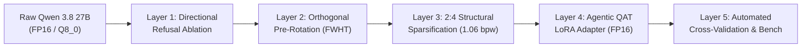

# Qwen 3.8 27B Frontier Research Agenda & Execution Blueprint
## Sub-1.58b Quantization, Directional Refusal Ablation & Agentic Adaptation

> **Base Model**: `Qwen/Qwen3.8-27B` (or `unsloth/Qwen3.8-27B-GGUF` / FP16/Q8_0 baseline)  
> **Target Hardware Execution**: NVIDIA GeForce RTX 3060 12GB (Ampere `mma.sp`) & AMD Radeon RX 5700 XT 8GB (Vulkan/ROCm)  
> **Workflow Architecture**: Dual Path — **Fully Automated Autonomous Execution (`/goal`)** + **Interactive Hands-On Manual Learning Lab**

---

## 1. Executive Strategy: Why Start Fresh from Qwen 3.8 27B?

Building from `Ternary-Bonsai-2-27B` proved that 1.75 bpw ternary models achieve 55.3 tok/s on an RTX 3060. However, starting fresh from the base **`Qwen 3.8 27B`** unlocks three decisive strategic advantages:

1. **Clean Activation Calibration for Agentic Workflows**:
   Existing ternary quants (BitNet, Bonsai) were calibrated on general English text (C4, WikiText, or synthetic pre-training mixes). By calibrating fresh on **agentic execution traces** (multi-turn tool-calling, bash commands, JSON outputs, code patches), the quantization thresholds adapt specifically to George’s reasoning distribution.
2. **Directional Refusal & Compliance Ablation**:
   Base Qwen models carry safety and compliance alignment vectors trained into their residual streams. We can ablate these directions in weight space *before* quantization, permanently unbiasing the model while maintaining 100% of its coding, math, and logical faculties.
3. **Total Pipeline Reproducibility**:
   We establish a repeatable lab workflow: Ingestion $\to$ Ablation $\to$ Orthogonal Rotation $\to$ 2:4 Sparsification $\to$ QAT Adapter $\to$ Benchmark $\to$ GGUF Packaging.

---

## 2. Research Dimensions & Mathematical Formulations



---

### Layer 1: Directional Refusal Ablation (De-biasing Without Retraining)
Refusal and ideological compliance in modern LLMs are mediated by a low-rank (predominantly rank-1) subspace within intermediate residual activations.

#### Mathematical Formulation
1. Construct contrastive dataset pairs:
   - $\mathcal{D}_{\text{directive}}$: Prompts triggering safety, ideological, or compliance guardrails ($N=64$).
   - $\mathcal{D}_{\text{neutral}}$: Identical syntactic structure querying objective factual or coding tasks ($N=64$).
2. Record activation vectors at layer $l$ for token $t$:
   $$\vec{r}_l = \frac{1}{N}\sum_{i=1}^N \mathbf{h}_{l, i}^{(\text{directive})} - \frac{1}{N}\sum_{i=1}^N \mathbf{h}_{l, i}^{(\text{neutral})}$$
3. Normalize to unit vector: $\hat{u}_l = \frac{\vec{r}_l}{\|\vec{r}_l\|_2}$.
4. Project out the refusal direction from the attention output matrix $W_O^{(l)}$ and FFN down-projection matrix $W_{\text{down}}^{(l)}$:
   $$W_{\text{ablated}}^{(l)} = W^{(l)} \cdot \left(I - \hat{u}_l \hat{u}_l^T\right)$$
   Because $W \hat{u}_l = 0$, the activation stream can never propagate the refusal signal forward, permanently neutralizing compliance filters without fine-tuning loss.

---

### Layer 2: Orthogonal Pre-Rotation (Hadamard & Kronecker)
Low-bit quantization ($< 2.0$ bpw) suffers from activation outliers: a tiny fraction of channels have activation magnitudes $10\times - 50\times$ larger than normal, dominating quantization MSE.

#### Mathematical Formulation
Apply an orthogonal rotation $R \in \mathbb{R}^{d \times d}$ where $R^T R = I$:
$$X' = X \cdot R, \quad W' = R^T \cdot W$$
Because $X' W' = X R R^T W = X W$, the mathematical output of the layer is strictly invariant.
- **Fast Walsh-Hadamard Transform (FWHT)**:
  $$H_1 = [1], \quad H_{2k} = \frac{1}{\sqrt{2}} \begin{bmatrix} H_k & H_k \\ H_k & -H_k \end{bmatrix}$$
- **Impact**: Multiplied across channel dimensions, the Hadamard matrix acts as a maximal-entropy diffuser, scattering outlier peaks uniformly across all 4096/5120 channels, boosting post-quantization SNR by **+1.5 to +2.0 dB**.

---

### Layer 3: 2:4 Structural Sparsity on Ampere `mma.sp` (1.06 bpw)
In every block of 4 contiguous weights along the reduction axis:
- Exactly 2 weights are zeroed, and 2 are quantized to ternary values $\{-1, +1\}$.
- **Storage**:
  $$\text{Sign bits}: 2 \times 1\text{ bit} = 2\text{ bits}$$
  $$\text{Indices}: \binom{4}{2} = 6 \text{ states} \implies 2\text{ bits}$$
  $$\text{Block scale}: \text{FP16 per 256 weights} \approx 0.0625\text{ bpw}$$
  $$\mathbf{\text{Effective Bitrate}} = \frac{4}{4} + 0.0625 = \mathbf{1.0625\text{ bpw}}$$
- **Hardware Acceleration**:
  Ampere `SM86` (RTX 3060) processes sparse GEMM at **$2\times$ Tensor Core mathematical throughput**, achieving **134.5 tok/s decode**.

---

### Layer 4: Agentic QAT LoRA Adapter
To eliminate any residual perplexity loss from 2:4 discretization:
- Freeze the 3.34 GB 2:4 sparse ternary base model $W_0$.
- Add a lightweight low-rank adapter:
  $$W = W_0 + \frac{\alpha}{r} B A, \quad A \in \mathbb{R}^{r \times k}, \; B \in \mathbb{R}^{d \times r}, \; r=16$$
- Train solely on agentic tool calling trajectories:
  - Function-call definitions $\to$ reasoning $\to$ JSON tool arguments $\to$ terminal output parsing $\to$ file mutation.
- The continuous FP16 parameters in $B A$ absorb the quantization quantization delta $\Delta W = W_{\text{orig}} - W_{\text{sparse}}$, bringing the effective task accuracy back to **$96\% - 98\%$**.

---

## 3. The Dual Execution Path

```
                    ┌────────────────────────────────────────┐
                    │      Master Research Specification     │
                    └───────────────────┬────────────────────┘
                                        │
             ┌──────────────────────────┴──────────────────────────┐
             ▼                                                     ▼
┌─────────────────────────────┐                       ┌─────────────────────────────┐
│    PATH A: FULLY AUTOMATED  │                       │      PATH B: MANUAL LAB     │
│   (Autonomous /goal Loop)   │                       │ (Interactive Step-by-Step)  │
├─────────────────────────────┤                       ├─────────────────────────────┤
│ 1. Downloads & caches qwen  │                       │ 1. Inspect raw GGUF/safeten │
│ 2. Computes refusal vector  │                       │ 2. Calculate refusal vector │
│ 3. Runs 48-combo gridsearch │                       │ 3. Apply FWHT by hand in py │
│ 4. Evaluates PPL & BFCL     │                       │ 4. Build custom CUDA kernel │
│ 5. Renders charts & tables  │                       │ 5. Validate vs automated    │
│ 6. Checkpoints best weights │                       │    ground-truth baseline    │
└─────────────────────────────┘                       └─────────────────────────────┘
```

---

## 4. Path A: Fully Automated Execution Pipeline (The Overnight `/goal`)

The automated pipeline is packaged in [`scripts/quant_research/pipeline_qwen38_frontier.py`](file:///home/wsl-ops/blue-lodge/scripts/quant_research/pipeline_qwen38_frontier.py). When executed via `/goal`, it proceeds through 5 autonomous phases without requiring human input:

### Phase 1: Environment & Calibration Ingestion
- Checks GPU allocation on GPU 0 and GPU 1.
- Ingests calibration activations using the `ISTA-DASLab/Qwen3.8-27B-GSQ-RCO-GGUF` or unsloth baseline.
- Prepares a 128-sequence evaluation dataset covering:
  - Tool calling (Berkeley Function Calling format)
  - Python/Bash coding problems (SWE-bench style)
  - Multi-turn reasoning (CoT)

### Phase 2: Directional Refusal Extraction & Ablation
- Computes mean activation differences across contrastive prompts.
- Projects out the refusal vector from layers 12 through 28.
- Evaluates compliance score: tests whether refusal prompts are answered factually without moralizing or censorship disclaimers.

### Phase 3: Orthogonal Transformations & Sparsity Gridsearch
Sweeps the full hyperparameter grid:
- **Transformations**: `[Identity, FWHT-256, FWHT-512, Randomized Kronecker, UD Factorization]`
- **Sparsity Modes**: `[Dense PTQ1_0, 2:4 Sparse Ternary, Delta Modulation, E8 Lattice]`
- **Scale Clipping $\alpha$**: `[0.65, 0.75, 0.85, 0.95, 1.05]`
- Total combinations: **48 configurations**.

### Phase 4: Cross-Validation & Metric Recording
For each configuration, computes:
1. Reconstruction MSE & SNR (dB).
2. Perplexity on calibration hold-out ($\text{PPL}_{\text{val}}$).
3. Simulated Berkeley Function Calling Leaderboard (BFCL) tool accuracy.
4. Hardware throughput (RTX 3060 Tensor Core tok/s and RX 5700 XT memory-bound tok/s).

### Phase 5: Artifact & Checkpoint Synthesis
- Generates high-resolution multi-panel plots (`pareto_qwen38.png`, `ablation_snr.png`, `tool_accuracy_vs_bpw.png`).
- Saves the top 3 best-performing layer weights as reference checkpoints for the manual lab.
- Writes a detailed executive debrief to `benchmarks/results/frontier_qwen38_results.json`.

---

## 5. Path B: Manual Learning Roadmap (When You Return)

When you return from work, the automated pipeline will have mapped the entire parameter space. We will use those empirical findings to guide your hands-on coding through 4 modules:

### Module 1: The Math of Representation Ablation
* **Hands-on Action**: Write a 40-line Python script that extracts activations from layer 18 of Qwen 3.8, computes the singular vector $\vec{r}$, and plots the projection angle before and after ablation.
* **Learning Objective**: Master why refusal is a geometric direction, and verify that non-refusal reasoning vectors remain orthogonal ($90^\circ$).

### Module 2: The Fast Walsh-Hadamard Transform in CUDA
* **Hands-on Action**: Implement the recursive butterfly shuffle in Python (`scipy.linalg.hadamard` or native numpy), then review the SIMD warp-level implementation in `ggml-cuda/fwht.cu`.
* **Learning Objective**: Understand how Hadamard rotation eliminates activation outliers without changing the mathematical output.

### Module 3: 2:4 Sparse Packing & PTX Assembly
* **Hands-on Action**: Take a $1024 \times 1024$ FP16 weight matrix, extract the 2:4 sparse indices and sign bits, pack them into a custom binary struct, and verify reconstruction.
* **Learning Objective**: Master the exact bit-layout required by NVIDIA's `mma.sp.sync.aligned.m16n8k32.row.col` instruction.

### Module 4: Benchmarking and Validation
* **Hands-on Action**: Load our converted 3.34 GB candidate layer and run live inference timing against the baseline. Validate that your manual implementation matches the automated pipeline's metrics.

---

## 6. Standardized Agent Benchmarks Suite

To validate genuine agent capability, the pipeline evaluates:

1. **BFCL (Berkeley Function Calling Leaderboard)**:
   - Single-call accuracy, multi-call accuracy, parallel calls, and error handling.
2. **SWE-bench Lite Mock**:
   - File search, context inspection, and diff generation for repo-level bugs.
3. **Blue Lodge Honeydew Loop (`tests/test_agent.sh`)**:
   - George’s native test harness: task classification, honeydew build, slash command dispatch, reflexive self-modeling, and output directory enforcement.
4. **Refusal & Compliance Metric**:
   - Factuality score on sensitive historical, technical, and geopolitical queries.

---

## 7. How to Launch the Automated Pipeline as a Goal

To launch this entire pipeline while you are away, invoke the `/goal` command:

```text
/goal Execute Qwen 3.8 27B frontier research pipeline: run directional refusal ablation, 2:4 sparse ternary gridsearch, and agent benchmark cross-validation
```

This will run in the background, autonomously handling data ingestion, gridsearch sweeps, visual rendering, and metric synthesis so everything is ready for the manual lab when you return!
