# Slash Command Self-Awareness

> How George knows, plans with, and executes his own slash commands.

## Overview

George is a fully self-aware agent with respect to his slash commands. He doesn't just *have* commands — he **knows** he has them, **plans** with them, and **invokes** them during autonomous task execution. This document explains the four-layer architecture that makes this possible and provides proof that each layer is operational.

## Architecture: Four Layers of Command Awareness

```
┌──────────────────────────────────────────────────────────┐
│  Layer 4: Identity (Modelfile SYSTEM + soul.md)          │
│  "I have slash commands. They are my working tools."     │
├──────────────────────────────────────────────────────────┤
│  Layer 3: Prompt Injection (memory_build_system_prompt)   │
│  commands_catalog() → injected into plan + task modes    │
├──────────────────────────────────────────────────────────┤
│  Layer 2: Response Parsing (tools_extract_slash_commands) │
│  Awk parser extracts /command lines outside code blocks  │
├──────────────────────────────────────────────────────────┤
│  Layer 1: Execution (tools_process_response phase 3)     │
│  Dispatches extracted commands via commands_dispatch()    │
└──────────────────────────────────────────────────────────┘
```

### Layer 1 — Execution Engine (`lib/tools.sh`)

When George generates a response containing a slash command, `tools_process_response()` runs three phases:

| Phase | Function | Purpose |
|-------|----------|---------|
| 1 | `tools_extract_bash()` | Extract and execute ```` ```bash ```` blocks |
| 2 | `tools_extract_files()` | Extract and write `# filepath:` code blocks |
| 3 | `tools_extract_slash_commands()` | Extract and dispatch `/command` lines |

Phase 3 uses an awk parser that:
- Tracks code block boundaries (``` toggles `in_block`)
- **Skips** any `/command` lines inside code blocks (avoids false positives from examples)
- **Emits** lines matching `^/[a-z]` that appear outside code blocks

```bash
# lib/tools.sh — tools_extract_slash_commands()
tools_extract_slash_commands() {
    local response="$1"
    echo "$response" | awk '
        /^```/   { in_block = !in_block; next }
        in_block { next }
        /^\/[a-z]/ { print }
    '
}
```

Each extracted command is dispatched through `commands_dispatch()` with
full timestamp logging:

```bash
# lib/tools.sh — tools_process_response() phase 3 (timestamped)
local slash_cmds
slash_cmds=$(tools_extract_slash_commands "$response")
if [ -n "$slash_cmds" ]; then
    while IFS= read -r scmd; do
        [ -z "$scmd" ] && continue
        local _cmd_start_ts
        _cmd_start_ts=$(date '+%Y-%m-%d %H:%M:%S')
        ui_section "Tool Invocation"
        ui_step "[$_cmd_start_ts] $scmd"
        if declare -f commands_dispatch &>/dev/null; then
            commands_dispatch "$scmd" "$workdir"
            local _cmd_rc=$?
            local _cmd_end_ts
            _cmd_end_ts=$(date '+%Y-%m-%d %H:%M:%S')
            local _cmd_status="OK"
            [ "$_cmd_rc" -ne 0 ] && _cmd_status="FAIL(exit $_cmd_rc)"
            results="${results:+$results; }[$_cmd_end_ts] $_cmd_status: $scmd"
        fi
    done <<< "$slash_cmds"
fi
```

All three phases of `tools_process_response()` now produce timestamped
results:

| Phase | Timestamp Format | Example |
|-------|------------------|---------|
| 1 — bash | `[$ts] OK/FAIL: shell commands (exit N)` | `[2026-03-01 14:32:10] OK: shell commands (exit 0)` |
| 2 — files | `[$ts] Wrote: <path>` | `[2026-03-01 14:32:11] Wrote: src/main.rs` |
| 3 — slash | `[$ts] OK/FAIL: /command` | `[2026-03-01 14:32:12] OK: /recall docker setup` |

### Layer 2 — Prompt Injection (`lib/memory.sh`)

George's system prompt is built by `memory_build_system_prompt()` using a three-tier strategy:

| Mode | Token Budget | Catalog Injected? | Soul Injected? | When Used |
|------|-------------|-------------------|----------------|-----------|
| `ask` | ~250 tokens | **No** — stays lean | Condensed (~250 tok) | `/ask` quick questions |
| `plan` (light) | ~700 tokens | **Yes** (lean catalog, ~400 tokens) | Condensed (~250 tok) | `agent_plan()` (LODGE_SOUL=0) |
| `plan` (dense) | ~5,000 tokens | **Yes** (lean catalog, ~400 tokens) | Full (~4,500 tok) | `agent_plan()` (LODGE_SOUL=1) |
| `task` | ~3,500 tokens | **Yes** (full catalog, ~1,443 tokens) | Full or condensed (LODGE_SOUL) | `memory_build_system_prompt` task mode |

The catalog is injected conditionally. **Plan mode uses a lean catalog** (`commands_catalog_plan()`) with compressed syntax to keep the prompt under ~700 tokens total, while task mode uses the full catalog with detailed descriptions:

```bash
# lib/memory.sh — plan mode (lean catalog)
if declare -f commands_catalog_plan &>/dev/null; then
    prompt="$prompt

$(commands_catalog_plan)"
elif declare -f commands_catalog &>/dev/null; then
    prompt="$prompt

$(commands_catalog)"
fi
```

```bash
# lib/memory.sh — task mode (full catalog, after RECALLED KNOWLEDGE)
if declare -f commands_catalog &>/dev/null; then
    prompt="$prompt

$(commands_catalog)"
fi
```

This means every time George plans or executes, his system prompt contains
the catalog **with a real-time clock timestamp**:

```
--- YOUR WORKING COMMANDS ---
You have these slash commands as tools. USE THEM in your plans and steps.
To invoke: output a line starting with / (e.g., /recall docker setup).

CURRENT DATE/TIME (from real-time clock): 2026-03-01 14:32:10 UTC
ALWAYS use this timestamp for any date references. NEVER make up a date.

/plan <task>         — Plan a task (no execution)
/ask <question>      — Quick question
/init <name> <lang>  — Scaffold a new project (types: rust, python, rl, data, automation, notebook, shell)
/recall <query>      — Search your knowledge base
/social post <text>  — Post to all configured social platforms
/pgp sign <msg>      — PGP-sign a message for authenticity
/sandbox create <n>  — Create isolated sandbox
/web search <query>  — Search the web
/journal write <text> — Write to your journal
... (40+ commands total)
```

The real-time clock injection ensures George **never hallucinates dates**
in file headers, journal entries, or commit messages.

### Layer 3 — Identity: Modelfile SYSTEM Prompt

The Modelfile SYSTEM prompt — baked into the model at creation time — contains an explicit instruction block:

```
CRITICAL: You have slash commands — these are YOUR working tools. When
planning or executing tasks, CHECK your command catalog and USE your
commands. Examples: /recall to search your knowledge, /social to post,
/pgp to sign messages, /sandbox to isolate work, /web to search. Output
/command lines directly and they will be executed. Always prefer your
built-in commands over raw shell when available.
```

The output rules also specify planning format:

```
Plans as short numbered lists (use [SUBTASK] for complex work)
```

### Conversation History (Ask Mode)

For `/ask` continuity, George maintains a **ring buffer** of the last 3 exchanges (configurable via `AGENT_CONV_MAX`). Each exchange stores the user's question and George's response (truncated to ~150 characters). This lets George remember recent conversation without bloating the prompt:

```
--- RECENT CONVERSATION ---
USER: what encryption does the vault use?
GEORGE: AES-256-CBC with PBKDF2 (100k iterations). Each secret is stored as a separate .enc file in ~/.george/.vault/...
USER: how do I rotate the key?
GEORGE: /secret rotate — this re-encrypts all secrets with a freshly generated key...
```

The conversation context is only injected into **ask mode** prompts. Plan and task modes don't include it.

### Subtask Parent Context

When George creates a recursive sub-plan via `[SUBTASK]`, the parent task description is injected into the subtask's planning prompt. This prevents the subtask from losing context about what it's building:

```
PARENT TASK CONTEXT: Build a URL shortener API with POST /shorten and GET /<id>
```

The recursion depth is limited to **2** levels (`AGENT_MAX_DEPTH=2`) to prevent runaway nesting.

### Layer 4 — Identity: soul.md Personality

The `soul.md` "My Working Commands" section establishes the *philosophy* of command use:

> Beyond shell and code, I have a set of **slash commands** — my own built-in tools, purpose-built for the work I do. These are not decorations; they are the working tools of my trade. When I plan a task, I check what commands I have. When I execute a step, I use them.
>
> **I must use my commands when they fit.** If a task involves posting to social media, I use `/social`, not a raw `curl` call. If I need to look something up in my own documentation, I use `/recall`, not `grep`. If I need to sign a message, I use `/pgp`.

The principle: **check my tools first, write raw code second.**

#### Soul Injection in the Dual-Loop Architecture

The refactored agent uses a dual-loop architecture (macro loop + inner loop). Soul injection is tiered:

| Phase | Soul Content | Purpose |
|-------|-------------|--------|
| `agent_plan()` (LODGE_SOUL=0) | Condensed soul (~250 tokens) | Identity + philosophy digest for plan generation |
| `agent_plan()` (LODGE_SOUL=1) | Full soul.md (~4,500 tokens) | Complete ethics propagate into plan milestones |
| `agent_run()` macro seed | Identity section (~90 tokens) | Persona context in macro_memory.md file |
| `agent_inner_loop()` | **None** | Speed-optimized; soul propagates passively via plan |
| `agent_ask()` | Condensed soul (~250 tokens) | Consistent identity in conversational mode |

The `/soul` command toggles `LODGE_SOUL` between 0 (light/condensed) and 1 (dense/full). This controls only the planning prompt — the inner loop stays soul-free by design.

### Agent Limits (`/limits`)

The `/limits` command provides runtime control over George's planning and execution bounds:

| Limit | Variable | Default | What it controls |
|-------|----------|---------|------------------|
| `steps` | `AGENT_PLAN_STEPS` | 5 | Max steps per plan/subtask |
| `depth` | `AGENT_MAX_DEPTH` | 2 | Subtask recursion ceiling |
| `milestones` | `AGENT_MAX_STEPS` | 20 | Macro loop milestone ceiling |
| `inner` | `AGENT_INNER_LOOPS` | 6 | Inner loop escalation retries |
| `delay` | `AGENT_STEP_DELAY` | 1 | Seconds between milestones |

Usage: `/limits` (show all), `/limits steps 8` (set), `/limits reset` (restore defaults). These are session-scoped — they reset when George restarts unless set via environment variables.

## Sequence Diagram: End-to-End Flow

The following diagram traces what happens when a user gives George a task that requires slash commands — from user input through planning, execution, command extraction, and dispatch.

```mermaid
sequenceDiagram
    participant U as User
    participant L as lodge (REPL)
    participant A as agent_run()
    participant P as agent_plan()
    participant M as memory_build_system_prompt()
    participant C as commands_catalog()
    participant LLM as Ollama LLM
    participant E as agent_execute_step()
    participant T as tools_process_response()
    participant X as tools_extract_slash_commands()
    participant D as commands_dispatch()
    participant R as /recall handler
    participant S as /social handler

    Note over U,S: Phase 1 — Planning (George learns his commands)
    U->>L: "Post a signed summary of our Docker docs to social media"
    L->>A: agent_run(task, workdir)
    A->>P: agent_plan(task, workdir)
    P->>M: memory_build_system_prompt(workdir, "", "plan")
    M->>C: commands_catalog()
    C-->>M: "--- YOUR WORKING COMMANDS ---<br/>/recall, /social, /pgp, /sandbox..."
    M-->>P: system_prompt with soul.md + GEORGE.md + catalog
    P->>LLM: llm_stream(task, system_prompt)
    Note over LLM: George sees his command catalog<br/>in the system prompt and plans<br/>with slash commands
    LLM-->>P: "1. /recall docker setup<br/>2. Summarize the results<br/>3. /pgp sign <summary><br/>4. /social post <signed summary>"
    P-->>A: plan (4 steps)

    Note over U,S: Phase 2 — Execution (George invokes his commands)

    rect rgb(40, 60, 40)
        Note over A,S: Step 1: /recall docker setup
        A->>E: agent_execute_step(1, "/recall docker setup")
        E->>M: memory_build_system_prompt(workdir) [task mode]
        M->>C: commands_catalog()
        C-->>M: catalog injected again
        M-->>E: full system prompt with catalog
        E->>LLM: llm_stream(step_desc, system_prompt)
        LLM-->>E: "/recall docker setup"
        E->>T: tools_process_response(response, workdir)
        T->>X: tools_extract_slash_commands(response)
        X-->>T: "/recall docker setup"
        T->>D: commands_dispatch("/recall docker setup")
        D->>R: _cmd_recall("docker setup")
        R-->>D: FTS5 search results (Docker docs)
        D-->>T: recall output
    end

    rect rgb(40, 40, 60)
        Note over A,S: Step 2: Summarize (bash/code — no slash commands)
        A->>E: agent_execute_step(2, "Summarize the results")
        E->>LLM: llm_stream(step_desc, system_prompt)
        LLM-->>E: "```bash<br/>echo 'Docker summary: ...'<br/>```"
        E->>T: tools_process_response(response)
        Note over T: Phase 1 runs bash<br/>Phase 3 finds no /commands
    end

    rect rgb(60, 40, 40)
        Note over A,S: Step 3: /pgp sign
        A->>E: agent_execute_step(3, "/pgp sign <summary>")
        E->>LLM: llm_stream(step_desc, system_prompt)
        LLM-->>E: "/pgp sign Docker infrastructure summary..."
        E->>T: tools_process_response(response)
        T->>X: tools_extract_slash_commands(response)
        X-->>T: "/pgp sign Docker infrastructure summary..."
        T->>D: commands_dispatch("/pgp sign ...")
        D-->>T: signed message
    end

    rect rgb(60, 50, 30)
        Note over A,S: Step 4: /social post
        A->>E: agent_execute_step(4, "/social post <signed>")
        E->>LLM: llm_stream(step_desc, system_prompt)
        LLM-->>E: "/social post -----BEGIN PGP SIGNED MESSAGE-----..."
        E->>T: tools_process_response(response)
        T->>X: tools_extract_slash_commands(response)
        X-->>T: "/social post ..."
        T->>D: commands_dispatch("/social post ...")
        D->>S: _cmd_social("post ...")
        S-->>D: Posted to X, Mastodon, Bluesky
    end

    A-->>L: "Task complete: 4/4 steps succeeded"
    L-->>U: ✓ Task complete
```



## Proof of Knowledge

### Proof 1: The Catalog Exists in Every Plan/Task Prompt

Run this in a bash session inside the lodge directory:

```bash
source lib/commands.sh
source lib/memory.sh
# The catalog function returns George's command reference:
commands_catalog | head -5
```

Expected output (timestamp will reflect current time):
```
--- YOUR WORKING COMMANDS ---
You have these slash commands as tools. USE THEM in your plans and steps.
To invoke: output a line starting with / (e.g., /recall docker setup).

CURRENT DATE/TIME (from real-time clock): 2026-03-01 14:32:10 UTC
```

### Proof 2: The Catalog is Injected into System Prompts

```bash
source lib/commands.sh
source lib/memory.sh
source lib/recall.sh 2>/dev/null
# Build a plan-mode prompt and check for the catalog:
memory_build_system_prompt "." "" "plan" | grep -c "YOUR WORKING COMMANDS"
```

Expected output: `1`

```bash
# Build a task-mode prompt and check:
memory_build_system_prompt "." "" "task" | grep -c "YOUR WORKING COMMANDS"
```

Expected output: `1`

```bash
# Verify ask mode does NOT include it (token budget):
memory_build_system_prompt "." "" "ask" | grep -c "YOUR WORKING COMMANDS"
```

Expected output: `0`

### Proof 3: Slash Commands Are Extracted from Responses

```bash
source lib/tools.sh

# Plain text response with a command:
tools_extract_slash_commands "Here is my plan:
/recall docker setup
Then I will summarize."
```

Expected output: `/recall docker setup`

```bash
# Commands inside code blocks are IGNORED:
tools_extract_slash_commands '```bash
/social post should not match
```
/recall the real command'
```

Expected output: `/recall the real command` (not the `/social` inside the code block)

### Proof 4: The Modelfile SYSTEM Prompt Mentions Commands

```bash
grep -c "slash commands" ~/blue-lodge/Modelfile
```

Expected output: `2` (once in the CRITICAL block, once in output rules)

### Proof 5: soul.md Establishes Command Philosophy

```bash
grep -c "Working Commands" ~/blue-lodge/soul.md
```

Expected output: `1` (the "My Working Commands" section header)

### Proof 6: Tests Verify the System

```bash
bash tests/run_all.sh 2>&1 | tail -10
```

All test files pass, including:
- `test_commands.sh` — tests `commands_catalog()` (non-empty, header, lists key commands, real-time clock) and `commands_help_topic()` (registered, unknown, slash-stripping)
- `test_tools.sh` — tests `tools_extract_slash_commands()` (plain text extraction, code block skipping, multiple commands, empty responses)
- `test_init.sh` — tests fuzzy type resolution, prerequisite guards, existing-project detection, swapped-argument handling, and end-to-end project scaffolding

## Real-Time Clock & Timestamps

Two mechanisms prevent George from ever hallucinating dates or producing
untracked results:

### Real-Time Clock Injection

Both `commands_catalog()` and `_slash_system_prompt()` inject the actual
output of `date` into the LLM prompt at generation time. This ensures
George always has access to the **real** current date/time, rather than
inventing one based on training data.

- **Command catalog**: `CURRENT DATE/TIME (from real-time clock): <ts>`
  followed by `ALWAYS use this timestamp for any date references. NEVER
  make up a date.`
- **Slash creation prompt**: `The current date and time is: <ts>` with
  an instruction to use it in the `Created:` header of generated commands.

### Dispatch & Execution Timestamps

All slash command dispatch and tool execution events now carry timestamps
from the system clock:

| Event | Format |
|-------|--------|
| Dispatch entry | `[$ts] Dispatching: /$cmd` |
| Dispatch failure | `[$ts] /$cmd failed (exit $rc)` |
| Unknown command | `[$ts] Unknown command: /$cmd` |
| Bash execution | `[$ts] OK/FAIL: shell commands (exit N)` |
| File write | `[$ts] Wrote: <path>` |
| Slash invocation | `[$ts] OK/FAIL: /command` |

## /init Guardrails & Fuzzy Type Resolution

The `/init` command now includes several safety layers:

### Directory-First Creation

`/init myapp rust` creates directory `myapp/` inside the CWD **first**,
then scaffolds inside it. On failure, the directory is cleaned up
automatically.

### Prerequisite Checks

Before scaffolding, `/init` verifies that the required toolchain is
installed:

| Type | Required | Check |
|------|----------|-------|
| `rust` | `cargo` | `command -v cargo` |
| `data`, `rl`, `automation`, `notebook` | `python3` + (`uv` or `pip3`) | `command -v python3 && (command -v uv \|\| command -v pip3)` |

Missing tools produce a clear error with install instructions.

### Existing Project Guard

If the CWD already contains `GEORGE.md`, `Cargo.toml`, or
`pyproject.toml`, `/init` refuses to run (prevents nesting projects).

### Fuzzy Type Resolver

`_init_resolve_type()` maps hallucinated or abbreviated type strings
to canonical types using a three-tier strategy:

1. **Exact match**: `rust`, `data`, `rl`, `automation`, `notebook`, `shell`
   (plus numeric aliases from the interactive menu)
2. **Heuristic match**: strip noise suffixes (`lang`, `project`, `app`),
   then match variants (`rs`→rust, `py`→data, `gymnasium`→rl,
   `bs4`→automation, `ipynb`→notebook, `bash`→shell)
3. **Substring fallback**: check if the input contains a canonical type
   name as a substring (`"rustproject"` → `rust`)

Guessed types produce a visible warning:
```
⚠ Interpreted 'rs' as type 'rust' (best guess)
```

### Swapped Argument Detection

If the user types `/init rust myapp` (type first, name second), George
detects the swap and corrects silently.

## Token Budget Impact

| Component | Tokens Added | Where |
|-----------|-------------|-------|
| `commands_catalog_plan()` | ~400 | plan system prompts (lean syntax) |
| `commands_catalog()` | ~1,443 | task system prompts (full descriptions) |
| Modelfile SYSTEM block | ~300 | SYSTEM prompt (overridden when system param passed) |
| Condensed soul | ~250 | `/ask` mode, plan mode (LODGE_SOUL=0) |
| Full soul.md | ~4,500 | Plan mode (LODGE_SOUL=1), task mode |
| Identity section | ~90 | `agent_run()` macro memory seed |
| Conversation history (ask) | ~300-600 | ask mode only (3 exchanges × ~150 chars each) |

Total additional tokens per plan call (light): **~650** (condensed soul + lean catalog).
Total additional tokens per plan call (dense): **~4,900** (full soul + lean catalog).
Total additional tokens per task call: **~1,443** (full catalog — soul.md already present).
Ask mode: **~250 tokens** (condensed soul + conversation history ~300-600 if exchanges exist).

With `num_ctx=32768`, the full task prompt budget is ~3,500 tokens for the system prompt, leaving ~26,700+ tokens for conversation history and generation. Even plan mode has ~31,000 tokens of headroom.

## The Design Principle

George's command awareness follows the **craftsman's principle** from `soul.md`:

> *Check my tools first, write raw code second.*

When George needs to search his knowledge, he uses `/recall` instead of writing `grep` commands. When he needs to post to social media, he uses `/social` instead of raw `curl` calls. When he needs to sign a message, he uses `/pgp` instead of calling `gpg` directly.

The slash commands are abstractions — they encapsulate configuration, error handling, and platform-specific logic. George uses them the way a craftsman uses a lathe: not because he can't do it by hand, but because the tool does it better.

## Command Reference

| Command | Purpose | Example |
|---------|---------|---------|
| `/plan <task>` | Plan without executing | `/plan refactor the API` |
| `/ask <question>` | Quick question | `/ask what is our test coverage?` |
| `/init <name> <lang>` | Scaffold project (fuzzy type matching, guardrails) | `/init myapp rust` |
| `/recall <query>` | Search knowledge base | `/recall docker setup` |
| `/save <file> <content>` | Save content to a file | `/save notes.md My summary` |
| `/write <file> <content>` | Write/overwrite a file | `/write src/main.rs fn main() {}` |
| `/download <url\|path> [dest]` | Download URL or copy file | `/download https://example.com/data.json` |
| `/build [release]` | Build the project | `/build release` |
| `/test [args]` | Run tests | `/test` |
| `/fix [error]` | Diagnose and fix errors | `/fix compile error in main.rs` |
| `/commit [msg]` | AI commit message | `/commit` |
| `/push` | Push to GitHub | `/push` |
| `/clone <url>` | Clone and setup repo | `/clone https://github.com/user/repo` |
| `/social post <text>` | Broadcast to all platforms | `/social post New release!` |
| `/social post <platform> <text>` | Post to one platform | `/social post x Hello X` |
| `/social send <platform> <text>` | Targeted/DM message | `/social send telegram Check this out` |
| `/social <platform> <action>` | Platform-specific action | `/social discord validate` |
| `/social discord validate` | Test Discord bot token | `/social discord validate` |
| `/social discord channels sync` | Auto-sync channel names from Discord | `/social discord channels sync` |
| `/social discord channels add <name> <id>` | Register a channel name | `/social discord channels add general 123...` |
| `/social discord channels list` | List registered channels | `/social discord channels list` |
| `/pgp sign <msg>` | Sign a message | `/pgp sign I approve this` |
| `/pgp signpost <msg>` | Sign and post | `/pgp signpost Release v2.0` |
| `/pgp export` | Export public key | `/pgp export` |
| `/sandbox create <name>` | Create sandbox | `/sandbox create test-env` |
| `/sandbox run <name> <cmd>` | Run in sandbox | `/sandbox run test-env make` |
| `/container create <distro>` | Create container | `/container create ubuntu` |
| `/container enter <name>` | Enter container | `/container enter ubuntu` |
| `/api keys set <K> <V>` | Set API key | `/api keys set GITHUB_TOKEN xxx` |
| `/secret set <k> <v>` | Store encrypted secret | `/secret set db_pass hunter2` |
| `/secret get <k>` | Retrieve secret | `/secret get db_pass` |
| `/web search <query>` | Web search | `/web search rust async patterns` |
| `/web fetch <url>` | Fetch URL | `/web fetch https://example.com` |
| `/journal write <text>` | Write journal entry | `/journal write learned about FTS5` |
| `/journal read` | Read recent entries | `/journal read` |
| `/wallet <coin> <action>` | Crypto wallet | `/wallet btc balance` |
| `/gsuite gmail\|drive\|docs` | Google Workspace | `/gsuite gmail inbox` |
| `/backup local` | Quick file backup | `/backup local` |
| `/backup restore [name]` | Restore from backup | `/backup restore` |
| `/backup export [dir]` | Export .george directory (portable) | `/backup export` |
| `/backup import <dir>` | Import from exported .george | `/backup import /path/to/.george` |
| `/backup git save` | Commit to backup repo | `/backup git save` |
| `/backup github` | Save + push to GitHub | `/backup github` |
| `/slash` | List custom commands | `/slash` |
| `/slash create <name> <desc>` | Create custom command | `/slash create greet Say hello` |
| `/slash <name> [args]` | Run custom command | `/slash greet world` |
| `/slash test <name>` | Test custom command | `/slash test greet` |
| `/files` | List workspace files | `/files` |
| `/read <file>` | Read a file | `/read src/main.rs` |
| `/status` | Agent status | `/status` |
| `/memory` | Show GEORGE.md | `/memory` |
| `/help [command]` | Show help | `/help pgp` |
| `/email <cmd>` | Email (ProtonMail/Zoho/Tuta/disposable) | `/email send user@ex.com "Subject" "Body"` |
| `/git <cmd>` | Git & GitHub configuration | `/git config` |
| `/github <query>` | Search GitHub repositories | `/github search rust async` |
| `/pgp sign <msg>` | PGP-sign a message | `/pgp sign I approve this` |
| `/pgp verify <msg>` | Verify a signed message | `/pgp verify <signed text>` |
| `/pgp export` | Export public key | `/pgp export` |
| `/vitals` | System vitals (CPU, RAM, disk, battery) | `/vitals` |
| `/limits` | View/adjust agent planning limits | `/limits steps 8` |
| `/model` | View/adjust sampling parameters (temp, penalties) | `/model temp 0.3` |
| `/debug` | Toggle debug mode (timers + token counts) | `/debug on` |
| `/think` | Toggle thinking mode on/off | `/think` |
| `/cleanup` | Remove George's created files | `/cleanup` |

---

*"He that hath a trade hath an estate; and he that hath a calling hath a place of profit and honor."* — Brother Benjamin Franklin
