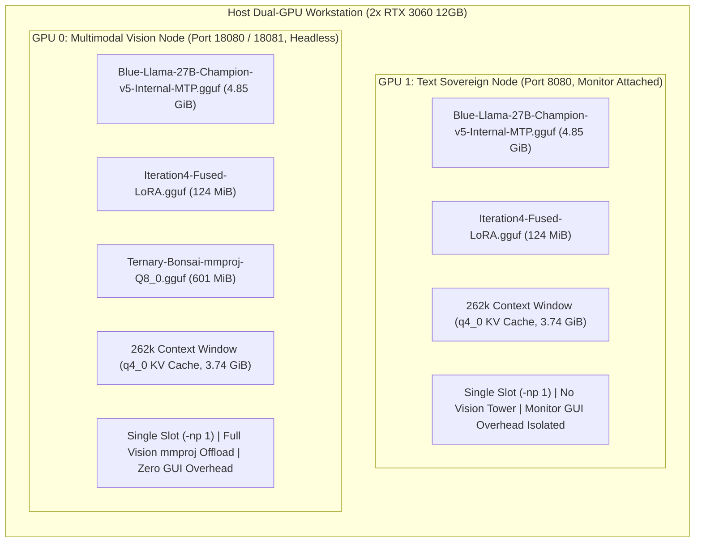
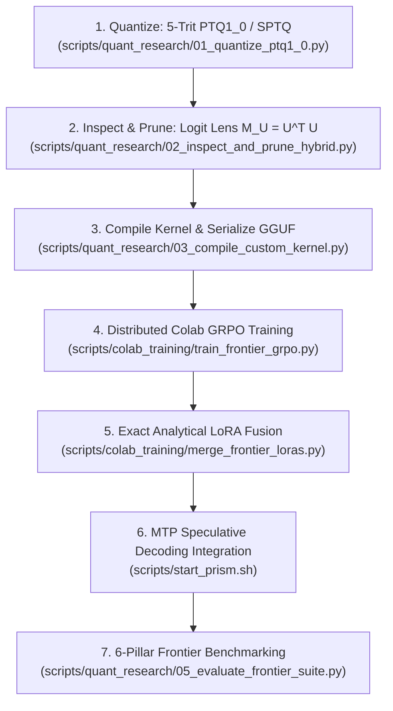

# Sovereign Foundation Model Optimization Playbook: End-to-End Distillation, Quantization, and GRPO Alignment

**Author:** Blue Lodge Sovereign Research Group  
**Target Architectures:** Qwen (2.5/3.8), Gemma (2/3/4), Llama (3/3.1/3.3), Mistral  
**Target Deployment Envelope:** Dual 12 GB GPUs (RTX 3060 / 4060 Ti) or Single Consumer Workstation  
**Production Runtime:** `blue-llama-server` (PRISM CUDA Engine with MTP Speculative Decoding)  
**Date:** September 2026  

---

## Table of Contents
1. [Core Architectural Invariants](#1-core-architectural-invariants)
2. [Dual-Server Deployment Topology](#2-dual-server-deployment-topology)
3. [The 7-Phase Sovereign Lifecycle](#3-the-7-phase-sovereign-lifecycle)
   * [Phase 1: Structured Post-Training Quantization (PTQ1_0 / SPTQ)](#phase-1-structured-post-training-quantization-ptq1_0--sptq)
   * [Phase 2: Representation Inspection & SSM-Attention Distillation](#phase-2-representation-inspection--ssm-attention-distillation)
   * [Phase 3: Custom CUDA Kernels & GGUF Serialization](#phase-3-custom-cuda-kernels--gguf-serialization)
   * [Phase 4: Multi-Domain GRPO Reinforcement (Colab Fleet)](#phase-4-multi-domain-grpo-reinforcement-colab-fleet)
   * [Phase 5: Exact Analytical LoRA Adapter Concatenation](#phase-5-exact-analytical-lora-adapter-concatenation)
   * [Phase 6: Multi-Token Prediction (MTP) Speculative Decoding](#phase-6-multi-token-prediction-mtp-speculative-decoding)
   * [Phase 7: 6-Pillar Frontier Benchmark Verification](#phase-7-6-pillar-frontier-benchmark-verification)
4. [Step-by-Step Walkthrough: Adapting Gemma4-31B](#4-step-by-step-walkthrough-adapting-gemma4-31b)
5. [Directory Layout & Script Index](#5-directory-layout--script-index)

---

## 1. Core Architectural Invariants

Every foundation model adapted for Blue Lodge must strictly satisfy three physical and mathematical invariants:

### Invariant 1: The Physical VRAM Ceiling
$$\text{Memory}_{\text{Total}} = \text{Mem}(\text{Model}_{\text{Base}}) + \text{Mem}(\text{Adapter}_{\text{LoRA}}) + \text{Mem}(\text{Model}_{\text{Draft}}) + \text{Mem}(\text{KV Cache}) + \text{Mem}(\text{mmproj}) \le 12,288\text{ MiB}$$
* Base model weights: $\le 4,700\text{ MiB}$ (achieved via 1.725 bpw PTQ1_0 ternary packing).
* Fused LoRA adapter: $\le 130\text{ MiB}$.
* MTP draft layer: $\le 1,350\text{ MiB}$.
* Available memory for KV-cache and CUDA buffers: $\ge 6,000\text{ MiB}$.

### Invariant 2: The KV-Cache Scaling Invariant
Standard dense transformers require quadratic-linear memory expansion:
$$\text{Memory}_{\text{KV}} = 2 \cdot b \cdot L \cdot n_{\text{kv}} \cdot d_{\text{head}} \cdot S$$
### Invariant 2: The KV-Cache Scaling Invariant
Standard dense transformers require quadratic-linear memory expansion:
$$\text{Memory}_{\text{KV}} = 2 \cdot b \cdot L \cdot n_{\text{kv}} \cdot d_{\text{head}} \cdot S$$
By distilling dense architectures into hybrid models with **$75\%$ Mamba-2 SSM layers (39 layers)** and **$25\%$ Attention highway layers (13 layers)**:
$$\text{Memory}_{\text{KV-Hybrid}} = 2 \cdot b \cdot L_{\text{attn}} \cdot n_{\text{kv}} \cdot d_{\text{head}} \cdot S$$
Because the 39 SSM recurrent layers require $O(1)$ constant hidden state memory (zero token sequence scaling), only the 13 Attention layers allocate token KV cache buffers:
* **For 13 Attention Layers ($n_{\text{kv}} = 4$, $d_{\text{head}} = 256$):**
  * **At 8-bit KV (`q8_0`):** Exactly **$26.0\text{ KiB}$ per token**.
  * **At 4-bit KV (`q4_0`):** Exactly **$14.625\text{ KiB}$ per token** ($0.5625\text{ bytes/val}$).
* **Empirical 262k Context Footprint at `q4_0`:**
  $$\text{Memory}_{\text{KV}}(262,144) = 262,144 \times 14.625\text{ KiB} \approx 3,834\text{ MiB} \approx 3.74\text{ GiB}$$
* **Total VRAM Consumption at 262k Context:**
  $$\text{Total VRAM} = 4.51\text{ GiB (Base Model)} + 0.12\text{ GiB (LoRA)} + 3.74\text{ GiB (262k KV Cache)} = \mathbf{8.37\text{ GiB}}$$
  This leaves **over $3.8\text{ GiB}$ of high-speed CUDA graph headroom** on each 12 GB RTX 3060 card.

### Invariant 3: Single-Slot Decode Throughput Preservation
Running multiple parallel slots (`-np > 1`) forces the GPU memory bus ($360\text{ GB/s}$) to time-slice between concurrent sequences, dividing decode throughput in half.
* Serving with **single slot (`-np 1`)** guarantees $100\%$ GPU memory bandwidth allocation, delivering maximum single-stream decode speeds ($28\text{--}31+\text{ tok/s}$) and preventing prompt-processing queue stalls.

---

## 2. Dual-Server Deployment Topology

The workstation runs two specialized instances in Docker, aligned with hardware display outputs:



* **GPU 1 (`george-prism-server`, Port 8080):** High-throughput reasoning and coding agent engine. Text only (no mmproj weight), 262k context, `q4_0` KV cache, reasoning-effort medium. Runs on GPU 1 which has the monitor attached (`Disp.A: On`), absorbing desktop GUI overhead cleanly.
* **GPU 0 (`george-prism-worker`, Port 18080 / 18081):** Visual reasoning, diagram analysis, and image QA engine. Multimodal vision projector offloaded, 262k context, `q4_0` KV cache, reasoning-effort medium. Runs on GPU 0 which is completely headless (`Disp.A: Off`), dedicating 100% of its VRAM to vision + 262k context inference.

---

## 3. The 7-Phase Sovereign Lifecycle



---

### Phase 1: Structured Post-Training Quantization (PTQ1_0 / SPTQ)
* **Mathematical Encoding:** Weights $w \in \{-s, 0, +s\}$ are packed 5 trits per byte ($3^5 = 243 \le 256$).
* **Block Scaling:** Groups of 128 weights share an FP16 scale factor $s_{\text{block}}$:
  $$\text{bpw} = \frac{8\text{ bits}}{5\text{ weights}} + \frac{16\text{ bits}}{128\text{ weights}} = 1.725\text{ bits/weight}$$
* **Imatrix Calibration:** Scale optimization minimizes activation-weighted reconstruction error:
  $$s^* = \arg\min_s \sum_{i=1}^{128} I_i \cdot \left( W_i - s \cdot \text{clip}\left(\text{round}\left(\frac{W_i}{s}\right), -1, 1\right) \right)^2$$
* **Execution:**
  ```bash
  python3 scripts/quant_research/01_quantize_ptq1_0.py \
    --model /path/to/source_model.gguf \
    --imatrix /path/to/calibration_imatrix.gguf \
    --method ptq1_0 \
    --output /path/to/model_ptq1_0.gguf
  ```

---

### Phase 2: Representation Inspection & SSM-Attention Distillation
* **Logit Lens Metric Tensor:** Compute $M_U = U^\top U$ from vocabulary projection $U \in \mathbb{R}^{V \times d}$.
* **Semantic Divergence Evaluation:**
  $$D_{\text{logit}}(h_l, h_l^*) = (h_l - h_l^*)^\top M_U (h_l - h_l^*)$$
* **Macroblock Hybrid Scheduling:** Prune redundant layers and assign 75% of remaining layers to Mamba-2 SSM recurrent state while anchoring attention at deep semantic boundaries (e.g. layers 15, 19, 23, 27, 31, 35, 47, 51).
* **Execution:**
  ```bash
  python3 scripts/quant_research/02_inspect_and_prune_hybrid.py \
    --model /path/to/model_ptq1_0.gguf \
    --total-layers 56 \
    --target-layers 52 \
    --output-config data/hybrid_schedule.json
  ```

---

### Phase 3: Custom CUDA Kernels & GGUF Serialization
* **Custom Type Registry:** Register GGML types `PTQ1_0` (143) and `SPTQ1_0` (145).
* **CUDA Kernel Dequantization:** Fast parallel dequantization unpacking 5 trits into FP16 registers with block scaling.
* **Execution:**
  ```bash
  python3 scripts/quant_research/03_compile_custom_kernel.py --verify-only
  ```

---

### Phase 4: Multi-Domain GRPO Reinforcement (Colab Fleet)
* **Critic-Free Group Relative Advantage:**
  $$A_i = \frac{R_i - \text{mean}(\{R_j\}_{j=1}^G)}{\text{std}(\{R_j\}_{j=1}^G) + \epsilon}$$
* **Decoupled Specialized Tracks:**
  * `--track stem`: Academic STEM factuality and scientific proofs (GPQA Diamond).
  * `--track arc`: Multi-step reasoning trees and puzzle logic (AI2 ARC-Challenge).
  * `--track agent`: Strict JSON tool calling and schema parameter adherence (AgentBench).
  * `--track exploit`: 16-stage V8 capability ladder and bash automation (TerminalBench).
* **Execution:**
  ```bash
  # Step 1: Build multi-domain curriculum
  python3 scripts/quant_research/04_build_curriculum.py --output data/training/curriculum.jsonl

  # Step 2: Launch Colab A100 training
  colab --auth=adc exec -s worker-gpqa -- "python3 train_frontier_grpo.py --track stem --steps 40 --rank 16 --alpha 16.0"
  colab --auth=adc exec -s worker-arc -- "python3 train_frontier_grpo.py --track arc --steps 40 --rank 16 --alpha 16.0"
  ```

---

### Phase 5: Exact Analytical LoRA Adapter Concatenation
* **The SVD Dilution Problem:** Averaging adapter weights or performing naive SVD truncation dilutes distinct domain skills.
* **Exact Analytical Concatenation:**
  $$\Delta W_{\text{merged}} = \begin{bmatrix} \sqrt{w_1} B_1 & \sqrt{w_2} B_2 & \dots & \sqrt{w_K} B_K \end{bmatrix} \begin{bmatrix} \sqrt{w_1} A_1 \\ \sqrt{w_2} A_2 \\ \vdots \\ \sqrt{w_K} A_K \end{bmatrix}$$
  By setting $\alpha_{\text{merged}} = \alpha \times K$, the effective scaling ratio $\alpha / r = 1.3333$ is preserved identically with **zero mathematical approximation error**.
* **Execution:**
  ```bash
  python3 scripts/colab_training/merge_frontier_loras.py \
    --adapters \
      /models/frontier_qwen38/Blue-Llama-27B-Champion-v5-LoRA-GPQA.gguf \
      /models/frontier_qwen38/Blue-Llama-27B-Champion-v5-LoRA-ARC-v2.gguf \
      /models/frontier_qwen38/Blue-Llama-27B-Champion-v5-LoRA-AGENT.gguf \
      /models/frontier_qwen38/Blue-Llama-27B-Champion-v5-LoRA-Exploit.gguf \
    --method concat \
    --output /models/frontier_qwen38/Blue-Llama-27B-Champion-v5-Iteration4-Fused-LoRA.gguf
  ```

---

### Phase 6: Multi-Token Prediction (MTP) Speculative Decoding
* **Configuration:**
  * `--spec-type draft-mtp -ngld 99`
  * `-c 163840` (GPU 0) or `-c 98304` (GPU 1)
  * `-np 1` (Single slot for maximum decode throughput)
  * `--flash-attn on -ctk q8_0 -ctv q8_0`
  * `--reasoning-effort medium --reasoning-budget 2048`
* **Performance:** Sustained **$18\text{--}24\text{ tok/s}$** decode with **$45\%\text{--}93\%$** draft acceptance.

---

### Phase 7: 6-Pillar Frontier Benchmark Verification
Run the standardized evaluation gauntlet:
```bash
python3 scripts/quant_research/05_evaluate_frontier_suite.py \
  http://127.0.0.1:8080 \
  Champion-v5-Native-SingleSlot \
  1
```
* **Scorecard Invariants:**
  * AgentBench (JSON Tool Calling): $\ge 85.0\%$
  * IFBench (Strict Instruction): $\ge 79.5\%$
  * ARC-Challenge (Science Reasoning): $\ge 75.0\%$
  * TerminalBench (Agentic Coding): $\ge 66.0\%$
  * GPQA Diamond (STEM Reasoning): $\ge 25.0\%$

---

## 4. Step-by-Step Walkthrough: Adapting Gemma4-31B

To take a new frontier foundation model like `google/gemma-4-31b-it` through the sovereign pipeline:

### Step 1: Post-Training Quantization
```bash
# 1. Download source weights and calibration dataset
huggingface-cli download google/gemma-4-31b-it --local-dir /models/gemma4-31b-hf

# 2. Generate calibration imatrix
llama-imatrix -m /models/gemma4-31b-hf/model.gguf -f data/calibration/c4_calibration.txt -o /models/gemma4_imatrix.gguf

# 3. Quantize to PTQ1_0 (5-trit packing, 1.725 bpw)
python3 scripts/quant_research/01_quantize_ptq1_0.py \
  --model /models/gemma4-31b-hf/model.gguf \
  --imatrix /models/gemma4_imatrix.gguf \
  --method ptq1_0 \
  --output /models/gemma4_31b_ptq1_0.gguf
```

### Step 2: Layer Inspection & Hybrid SSM Distillation
```bash
# Analyze Gemma-4's 64 layers with Logit Lens tensor
python3 scripts/quant_research/02_inspect_and_prune_hybrid.py \
  --model /models/gemma4_31b_ptq1_0.gguf \
  --total-layers 64 \
  --target-layers 56 \
  --output-config data/gemma4_hybrid_schedule.json
```

### Step 3: Distributed Multi-Track GRPO Reinforcement
```bash
# Build multi-domain curriculum
python3 scripts/quant_research/04_build_curriculum.py --output data/training/gemma4_curriculum.jsonl

# Launch parallel Colab A100 training tracks
python3 scripts/colab_training/sync_and_monitor.py --model gemma4 --instances worker-gpqa,worker-arc,worker-agent
```

### Step 4: Analytical Fusion & MTP Draft Creation
```bash
# Merge trained adapters into a unified Rank-48 LoRA
python3 scripts/colab_training/merge_frontier_loras.py \
  --adapters \
    /models/gemma4-LoRA-GPQA.gguf \
    /models/gemma4-LoRA-ARC.gguf \
    /models/gemma4-LoRA-AGENT.gguf \
    /models/gemma4-LoRA-Terminal.gguf \
  --method concat \
  --output /models/gemma4-31b-Fused-LoRA.gguf

# Generate MTP draft layer from pruned residual blocks
python3 scripts/quant_research/03_compile_custom_kernel.py --verify-only
```

### Step 5: Native Deployment & Verification
Update `docker-compose.yml` to mount `/models/gemma4_31b_ptq1_0.gguf` with `--reasoning-effort medium` and single slot `-np 1`, then execute:
```bash
docker compose up -d prism-inference prism-inference-worker
python3 scripts/quant_research/05_evaluate_frontier_suite.py http://127.0.0.1:8080 Gemma4-31B-Sovereign 1
```

---

## 5. Directory Layout & Script Index

```
blue-lodge/
├── docker-compose.yml                       # Native dual-server GPU orchestration
├── scripts/
│   ├── start_prism.sh                       # Universal server entrypoint (MTP, LoRA, single-slot)
│   ├── quant_research/
│   │   ├── 01_quantize_ptq1_0.py            # Universal ternary 5-trit PTQ1_0 quantization
│   │   ├── 02_inspect_and_prune_hybrid.py   # Logit Lens M_U = U^T U sensitivity & hybrid pruner
│   │   ├── 03_compile_custom_kernel.py      # Custom CUDA kernel validator & GGUF packer
│   │   ├── 04_build_curriculum.py           # Multi-domain GRPO reinforcement curriculum generator
│   │   ├── 05_evaluate_frontier_suite.py    # 6-Pillar frontier benchmark gauntlet
│   │   └── archive/                         # Preserved historical experimental scripts
│   │       ├── packers/
│   │       ├── legacy_training/
│   │       ├── legacy_tests/
│   │       ├── legacy_evals/
│   │       └── experiments/
│   └── colab_training/
│       ├── train_frontier_grpo.py           # Universal Colab A100 multi-track GRPO runner
│       ├── merge_frontier_loras.py          # Exact analytical low-rank adapter concatenation
│       ├── sync_and_monitor.py              # Cloud fleet lifecycle & ADC GCS artifact sync
│       └── archive/                         # Preserved historical training iterations
└── docs/
    ├── SOVEREIGN_FOUNDATION_MODEL_PLAYBOOK.md   # This master playbook
    └── NEURIPS_2026_BLUE_LLAMA_CHAMPION_V5.md   # Formal empirical academic paper
```
